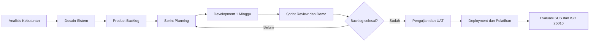
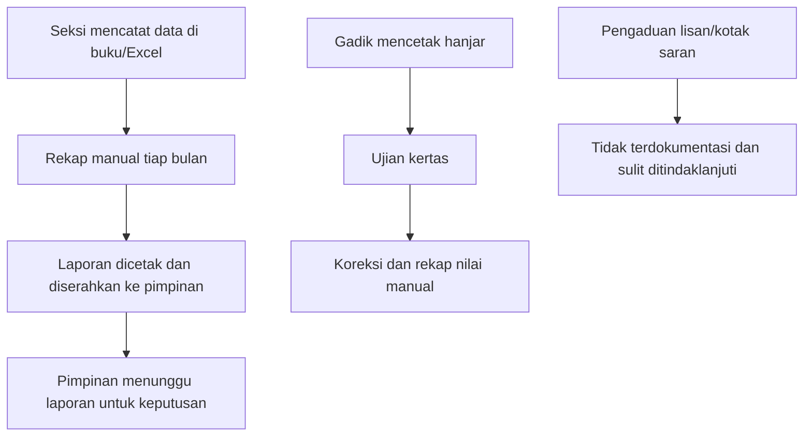
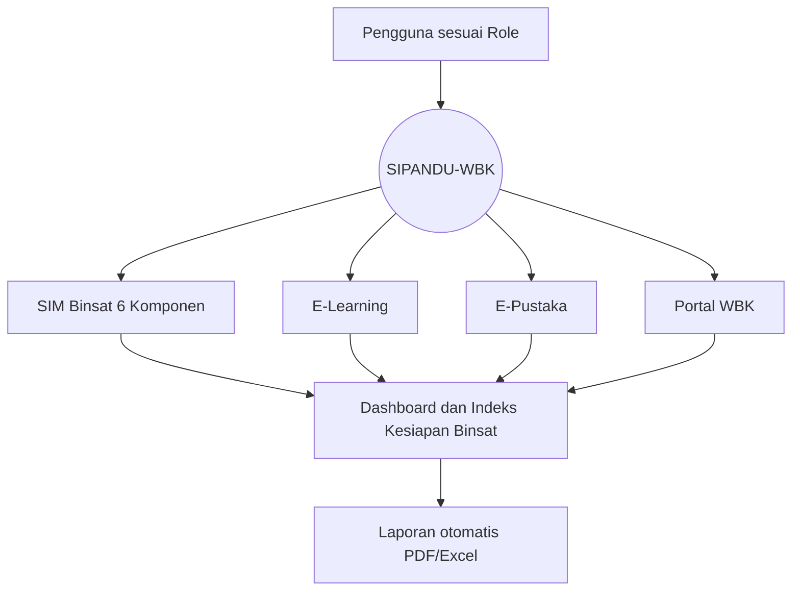

# DOKUMEN PENELITIAN
## Rancang Bangun Sistem Informasi Pembinaan Satuan Pendidikan Terpadu Berbasis Wilayah Bebas dari Korupsi (SIPANDU-WBK) dengan Integrasi E-Learning dan Perpustakaan Digital Menggunakan Framework Laravel
### Studi Kasus: Resimen Induk Daerah Militer (Rindam)

---

## BAB I — PENDAHULUAN

### 1.1 Latar Belakang

Rindam sebagai satuan pendidikan di jajaran Kodam memiliki tugas pokok menyelenggarakan pendidikan pertama, pendidikan pembentukan, dan pendidikan kejuruan bagi prajurit. Agar tugas pokok tersebut terlaksana optimal, satuan wajib melaksanakan **Pembinaan Satuan (Binsat)** yang mencakup enam komponen:

1. **Pembinaan Organisasi** — penataan struktur dan fungsi satuan sesuai TOP (Tabel Organisasi dan Peralatan).
2. **Pembinaan Personel** — pengelolaan kekuatan, pemenuhan jabatan, dan pemeliharaan moril prajurit.
3. **Pembinaan Materiil** — perawatan, pemeliharaan, dan inventarisasi alutsista serta perlengkapan satuan.
4. **Pembinaan Fasilitas/Pangkalan** — pemeliharaan pangkalan, perkantoran, perumahan, dan fasilitas pendukung.
5. **Pembinaan Latihan** — latihan bertahap, bertingkat, dan berlanjut guna memelihara kesiapsiagaan.
6. **Pembinaan Doktrin/Piranti Lunak** — penerapan dan pemahaman ketentuan, petunjuk, dan naskah dinas.

Di sisi lain, pemerintah mendorong setiap instansi membangun **Zona Integritas (ZI) menuju Wilayah Bebas dari Korupsi (WBK)** dan Wilayah Birokrasi Bersih dan Melayani (WBBM) sebagaimana diatur dalam PermenPAN-RB No. 90 Tahun 2021. Salah satu syarat penilaian ZI adalah tersedianya **inovasi pelayanan berbasis teknologi informasi**, transparansi informasi, sarana pengaduan, dan survei kepuasan masyarakat.

Hasil observasi awal (perlu divalidasi pada Minggu 1) menunjukkan permasalahan umum sebagai berikut:

| No | Permasalahan | Dampak |
|----|--------------|--------|
| 1 | Data Binsat tersebar di berkas fisik dan file Excel masing-masing seksi | Sulit direkap, rawan hilang, data tidak sinkron |
| 2 | Laporan kesiapan satuan disusun manual menjelang pemeriksaan/Wasrik | Memakan waktu, tidak *real-time* |
| 3 | Distribusi hanjar (bahan ajar) dan naskah doktrin masih berbentuk cetak | Biaya cetak tinggi, versi naskah tidak terkontrol |
| 4 | Evaluasi belajar siswa dilakukan manual | Rekap nilai lambat, potensi kesalahan input |
| 5 | Koleksi perpustakaan belum terdigitalisasi | Akses terbatas pada jam dan lokasi tertentu |
| 6 | Sarana pengaduan dan survei kepuasan belum terpusat | Bukti dukung penilaian ZI/WBK lemah |

Berdasarkan kondisi tersebut diperlukan suatu sistem informasi terpadu yang mampu **mendigitalkan enam komponen Binsat, menyediakan e-learning dan perpustakaan digital, serta mendukung pembangunan Zona Integritas menuju WBK**.

### 1.2 Rumusan Masalah

1. Bagaimana merancang sistem informasi yang mampu mengelola data enam komponen Binsat secara terpusat dan terukur?
2. Bagaimana mengintegrasikan e-learning dan perpustakaan digital ke dalam satu platform satuan pendidikan?
3. Bagaimana sistem dapat mendukung pemenuhan indikator Zona Integritas menuju WBK (transparansi, akuntabilitas, pengawasan, dan kualitas pelayanan)?
4. Bagaimana tingkat kualitas dan penerimaan pengguna (*usability*) terhadap sistem yang dibangun?

### 1.3 Tujuan Penelitian

1. Membangun modul SIM Binsat yang mencakup enam komponen pembinaan dengan **Indeks Kesiapan Binsat** otomatis.
2. Membangun modul E-Learning (LMS) dan E-Pustaka yang terintegrasi dengan data personel/siswa.
3. Membangun Portal WBK yang menyediakan layanan pengaduan, survei kepuasan, lapor gratifikasi, dan keterbukaan informasi.
4. Mengukur kualitas sistem berdasarkan ISO/IEC 25010 dan tingkat *usability* menggunakan *System Usability Scale* (SUS).

### 1.4 Manfaat Penelitian

| Pihak | Manfaat |
|-------|---------|
| **Pimpinan (Danrindam & Staf)** | Dashboard kesiapan satuan *real-time* sebagai dasar pengambilan keputusan |
| **Seksi/Staf Pelaksana** | Pengelolaan data lebih cepat, laporan otomatis (PDF/Excel) |
| **Gadik (Tenaga Pendidik)** | Distribusi materi, ujian, dan penilaian secara daring |
| **Siswa/Serdik** | Akses hanjar, materi, dan e-book kapan saja |
| **Tim Zona Integritas** | Bukti dukung digital untuk 6 area perubahan ZI |
| **Masyarakat** | Akses informasi publik dan saluran pengaduan yang transparan |
| **Akademik** | Referensi pengembangan sistem informasi di lingkungan satuan pendidikan militer |

### 1.5 Batasan Masalah

1. Sistem dibangun berbasis web menggunakan **Laravel (versi stabil terbaru), PHP 8.3+, dan MySQL/MariaDB**.
2. Data yang dikelola adalah data **berklasifikasi biasa/terbatas**; data berklasifikasi **rahasia** tidak disimpan di sistem.
3. Modul Binsat bersifat pencatatan, monitoring, dan pelaporan — tidak menggantikan sistem resmi TNI AD yang sudah ada (mis. aplikasi personel/logistik pusat), namun dapat menyiapkan format ekspor.
4. E-Learning mencakup materi, kuis/ujian pilihan ganda & esai, tugas, dan penilaian; tidak mencakup *video conference* bawaan (dapat ditautkan ke layanan eksternal).
5. E-Pustaka mencakup katalog, e-book/PDF *viewer* (tanpa unduh), dan sirkulasi buku fisik.
6. Waktu pengembangan **± 8 minggu** (5 Oktober – 27 November 2026).

---

## BAB II — LANDASAN TEORI

### 2.1 Pembinaan Satuan (Binsat)
Binsat adalah segala usaha, pekerjaan, dan kegiatan yang berhubungan dengan perencanaan, pengorganisasian, pelaksanaan, dan pengawasan terhadap satuan agar selalu dalam kondisi siap operasional. Pengukuran Binsat dilakukan melalui enam komponen (Organisasi, Personel, Materiil, Fasilitas/Pangkalan, Latihan, Doktrin/Piranti Lunak). *(Rujukan resmi disesuaikan dengan Peraturan Kasad / Bujuk tentang Binsat yang berlaku di satuan.)*

### 2.2 Zona Integritas menuju WBK/WBBM
Berdasarkan **PermenPAN-RB No. 90 Tahun 2021**, pembangunan ZI dilakukan melalui **6 area perubahan** (komponen pengungkit):

| Area Perubahan ZI | Dukungan Fitur Sistem |
|-------------------|-----------------------|
| 1. Manajemen Perubahan | Agenda & dokumentasi kegiatan ZI, publikasi inovasi |
| 2. Penataan Tatalaksana | SOP digital, e-office, keterbukaan informasi publik |
| 3. Penataan Sistem Manajemen SDM | Modul Personel, rekam diklat, penilaian kinerja |
| 4. Penguatan Akuntabilitas | Dashboard kinerja, laporan otomatis, Indeks Binsat |
| 5. Penguatan Pengawasan | Lapor gratifikasi, Whistleblowing System (WBS), audit log |
| 6. Peningkatan Kualitas Pelayanan Publik | Standar & maklumat pelayanan, Survei Kepuasan Masyarakat (SKM), pengaduan |

Indikator hasil (komponen hasil): **Indeks Persepsi Anti Korupsi (IPAK)** dan **Indeks Persepsi Kualitas Pelayanan (IPKP)** — keduanya dapat dikumpulkan melalui modul survei.

### 2.3 Sistem Informasi Manajemen
Sistem informasi manajemen adalah sistem yang mengumpulkan, memproses, menyimpan, dan menyajikan informasi untuk mendukung fungsi operasional, manajerial, dan pengambilan keputusan dalam organisasi.

### 2.4 E-Learning dan Learning Management System (LMS)
E-learning adalah pembelajaran yang memanfaatkan teknologi elektronik. LMS adalah perangkat lunak untuk administrasi, dokumentasi, pelacakan, pelaporan, dan penyampaian materi pembelajaran. Model yang digunakan adalah **blended learning**: tatap muka di kelas/lapangan dikombinasikan dengan materi dan evaluasi daring.

### 2.5 Perpustakaan Digital
Perpustakaan digital adalah perpustakaan yang koleksinya disimpan dalam format digital dan dapat diakses melalui jaringan. Mengacu pada **UU No. 43 Tahun 2007 tentang Perpustakaan**, perpustakaan khusus (termasuk di instansi militer) berfungsi mendukung pendidikan dan penelitian di lingkungannya.

### 2.6 Framework Laravel
Laravel adalah framework PHP *open-source* dengan pola **MVC (Model–View–Controller)**. Keunggulan: Eloquent ORM, migrasi basis data, sistem autentikasi/otorisasi bawaan, *queue*, *scheduler*, proteksi CSRF/XSS/SQL Injection, serta ekosistem paket yang luas (Filament, Livewire, Spatie).

### 2.7 Role-Based Access Control (RBAC)
RBAC adalah model kontrol akses yang memberikan hak akses berdasarkan peran (*role*) pengguna. Sangat penting di lingkungan militer karena prinsip **need-to-know**.

### 2.8 Metode Scrum
Scrum adalah kerangka kerja Agile yang membagi pengembangan menjadi iterasi pendek (*sprint*) dengan *deliverable* yang dapat diuji di setiap akhir sprint. Artefak: *Product Backlog*, *Sprint Backlog*, *Increment*. Seremoni: *Sprint Planning*, *Daily Scrum*, *Sprint Review*, *Sprint Retrospective*.

### 2.9 ISO/IEC 25010
Standar kualitas perangkat lunak dengan karakteristik: *Functional Suitability, Performance Efficiency, Compatibility, Usability, Reliability, Security, Maintainability, Portability*.

### 2.10 System Usability Scale (SUS)
Kuesioner 10 butir skala Likert 1–5 untuk mengukur *usability*. Skor 0–100; skor **≥ 68** dikategorikan *acceptable* (di atas rata-rata), **≥ 80,3** kategori *Excellent* (Grade A).

### 2.11 Regulasi Pendukung
- UU No. 14 Tahun 2008 tentang Keterbukaan Informasi Publik
- UU No. 27 Tahun 2022 tentang Pelindungan Data Pribadi
- Perpres No. 95 Tahun 2018 tentang Sistem Pemerintahan Berbasis Elektronik (SPBE)
- PermenPAN-RB No. 90 Tahun 2021 tentang Pembangunan dan Evaluasi ZI menuju WBK/WBBM
- UU No. 43 Tahun 2007 tentang Perpustakaan
- Ketentuan internal TNI AD tentang Binsat, pengamanan informasi, dan penggunaan TI (disesuaikan)

### 2.12 Penelitian Terdahulu (Template — diisi pada Minggu 1)

| No | Peneliti/Tahun | Judul | Metode | Hasil | Perbedaan dengan Penelitian Ini |
|----|----------------|-------|--------|-------|----------------------------------|
| 1 | … | Sistem informasi inventaris/ materiil satuan | … | … | Belum mencakup 6 komponen Binsat |
| 2 | … | LMS berbasis Laravel/Moodle di lembaga diklat | … | … | Tidak terintegrasi data satuan |
| 3 | … | Website Zona Integritas instansi pemerintah | … | … | Hanya portal informasi, tanpa SIM |

> Kebaruan (*novelty*) penelitian ini: **integrasi SIM Binsat 6 komponen + LMS + Perpustakaan Digital + Portal WBK dalam satu platform**, dilengkapi **Indeks Kesiapan Binsat** otomatis.

---

## BAB III — METODOLOGI PENELITIAN

### 3.1 Jenis Penelitian
**Research and Development (R&D)** — menghasilkan produk perangkat lunak dan menguji kelayakannya.

### 3.2 Model Pengembangan: Scrum (Sprint 1 Minggu)



### 3.3 Lokasi dan Waktu
- **Lokasi**: Rindam (Markas, Dodik, Perpustakaan, dan seksi-seksi staf terkait)
- **Waktu**: 5 Oktober – 27 November 2026 (8 minggu) + 1 minggu pendampingan opsional

### 3.4 Teknik Pengumpulan Data

| Teknik | Sasaran | Output |
|--------|---------|--------|
| **Observasi** | Proses kerja seksi Pers, Log, Ops/Diklat, Perpustakaan, Tim ZI | Peta proses bisnis berjalan (*as-is*) |
| **Wawancara** | Pejabat staf, Gadik, Pustakawan, Tim ZI, perwakilan siswa | Daftar kebutuhan & permasalahan |
| **Studi Dokumen** | TOP/DSPP, format laporan Binsat, kurikulum, hanjar, lembar kerja ZI | Struktur data & format laporan |
| **Kuesioner** | Pengguna akhir (pra & pasca implementasi) | Data SUS & ISO 25010 |
| **Studi Pustaka** | Jurnal, buku, regulasi | Landasan teori |

### 3.5 Responden

| Kelompok | Jumlah (estimasi) | Teknik Sampling |
|----------|-------------------|-----------------|
| Pejabat/Staf pengelola Binsat | 10–15 orang | *Purposive* |
| Gadik | 10–20 orang | *Purposive* |
| Siswa/Serdik | 30–50 orang | *Random sampling* |
| Pustakawan & Tim ZI | 3–5 orang | *Total sampling* |

### 3.6 Instrumen Penelitian
1. Pedoman wawancara (Lampiran A)
2. Lembar *black-box testing* per modul
3. Kuesioner SUS (Lampiran B)
4. Kuesioner ISO/IEC 25010 (skala Likert 1–5)
5. Lembar *User Acceptance Test* (UAT) dengan tanda tangan pengguna kunci

### 3.7 Teknik Analisis Data

**a. Black-Box Testing**
```
Persentase keberhasilan = (Jumlah skenario lulus / Total skenario) × 100%
Target: ≥ 95% skenario lulus sebelum go-live, 100% untuk skenario kritis
```

**b. System Usability Scale**
```
Butir ganjil  : skor = nilai responden − 1
Butir genap   : skor = 5 − nilai responden
Skor SUS      = (Σ skor 10 butir) × 2,5
Rata-rata SUS = Σ skor SUS responden / jumlah responden
Target: ≥ 68 (Acceptable), ideal ≥ 80,3 (Excellent)
```

**c. ISO/IEC 25010 (Likert)**
```
Persentase kelayakan = (Skor aktual / Skor ideal) × 100%
81–100% Sangat Layak | 61–80% Layak | 41–60% Cukup | 21–40% Kurang | 0–20% Tidak Layak
```

**d. Performance Testing**
- Waktu muat halaman ≤ 3 detik (jaringan LAN/intranet)
- Mampu melayani ≥ 200 pengguna konkuren (ujian serentak) — diuji dengan *k6* / *Apache JMeter*

**e. Security Testing**
- Checklist **OWASP Top 10** dan pemindaian dengan *OWASP ZAP*

---

## BAB IV — ANALISIS DAN PERANCANGAN (RINGKASAN)

> Detail lengkap lihat [02_Blueprint_Sistem.md](02_Blueprint_Sistem.md).

### 4.1 Analisis Sistem Berjalan (*As-Is*)



### 4.2 Sistem Usulan (*To-Be*)



### 4.3 Identifikasi Aktor

| Aktor | Deskripsi |
|-------|-----------|
| Super Admin | Pengelola teknis sistem (pengguna, role, konfigurasi, backup) |
| Pimpinan | Danrindam/Wadan/Kepala Staf — melihat dashboard & laporan, memberi disposisi |
| Operator Binsat | Staf seksi (Pers, Log, Ops/Diklat, dll.) — mengelola data per komponen |
| Gadik | Membuat kelas, materi, kuis/ujian, tugas, memberi nilai |
| Siswa/Serdik | Mengikuti pembelajaran, ujian, membaca e-pustaka |
| Pustakawan | Mengelola katalog, e-book, sirkulasi |
| Tim ZI/WBK | Mengelola pengaduan, gratifikasi, survei, konten transparansi |
| Publik | Mengakses portal, mengirim pengaduan, mengisi survei |

### 4.4 Kebutuhan Fungsional (Ringkas)

| Kode | Kebutuhan | Prioritas |
|------|-----------|-----------|
| F-01 | Login, logout, reset password, 2FA untuk role admin/pimpinan | Must |
| F-02 | Manajemen pengguna, role, dan permission | Must |
| F-03 | Pembinaan Organisasi: data TOP/DSPP, struktur jabatan, perbandingan riil vs TOP | Must |
| F-04 | Pembinaan Personel: data personel, kekuatan, pemenuhan jabatan, moril, mutasi | Must |
| F-05 | Pembinaan Materiil: inventaris, kondisi, jadwal pemeliharaan, mutasi barang | Must |
| F-06 | Pembinaan Fasilitas: data gedung, rumah dinas, kondisi, permintaan perbaikan | Must |
| F-07 | Pembinaan Latihan: program, jadwal, peserta, hasil/evaluasi latihan | Must |
| F-08 | Pembinaan Doktrin: repositori naskah, versi, sosialisasi, tes pemahaman | Must |
| F-09 | Indeks Kesiapan Binsat & dashboard pimpinan | Must |
| F-10 | E-Learning: kelas, materi, kuis/ujian, tugas, nilai, sertifikat | Must |
| F-11 | E-Pustaka: katalog, e-book viewer, peminjaman, pengembalian, denda/sanksi | Must |
| F-12 | Portal WBK: profil, berita, standar & maklumat pelayanan, info publik | Must |
| F-13 | Pengaduan/WBS dengan nomor tiket & pelacakan status | Must |
| F-14 | Survei Kepuasan Masyarakat (SKM), IPAK, IPKP | Must |
| F-15 | Lapor gratifikasi | Should |
| F-16 | Notifikasi (in-app & email) | Should |
| F-17 | Ekspor laporan PDF/Excel | Must |
| F-18 | Audit log seluruh aktivitas | Must |
| F-19 | Forum diskusi kelas | Could |
| F-20 | Aplikasi mobile / PWA | Could |

### 4.5 Kebutuhan Non-Fungsional

| Aspek | Kebutuhan |
|-------|-----------|
| Keamanan | HTTPS, hash password (bcrypt/argon2), 2FA, RBAC, proteksi CSRF/XSS/SQLi, rate limiting, audit log |
| Kerahasiaan | Data sensitif personel dienkripsi; pengaduan WBS dapat anonim |
| Kinerja | Halaman ≤ 3 detik; ujian serentak ≥ 200 pengguna |
| Ketersediaan | Uptime ≥ 99% jam kerja; backup harian otomatis |
| Usability | Responsif (desktop, tablet, ponsel), skor SUS ≥ 68 |
| Maintainability | Kode mengikuti PSR-12, terdokumentasi, *automated test* untuk modul kritis |
| Portabilitas | Dapat berjalan di server Linux/Windows (Laragon untuk pengembangan) |

---

## BAB V — RENCANA PENGUJIAN & INDIKATOR KEBERHASILAN

### 5.1 Rencana Pengujian

| Jenis Uji | Waktu | Pelaksana | Alat |
|-----------|-------|-----------|------|
| Unit & Feature Test | Setiap sprint | Developer | Pest/PHPUnit |
| Black-Box Test | Akhir setiap sprint | QA | Lembar uji |
| Integration Test | Minggu 7 | QA + Developer | Pest, manual |
| Performance Test | Minggu 8 | Developer | k6 / JMeter |
| Security Test | Minggu 8 | Developer | OWASP ZAP, checklist |
| UAT | Minggu 8 | Pengguna kunci | Lembar UAT |
| SUS & ISO 25010 | Minggu 8 (pasca pelatihan) | Peneliti | Kuesioner |

### 5.2 Key Performance Indicator (KPI) Proyek

| KPI | Target |
|-----|--------|
| Modul selesai sesuai backlog *Must* | 100% |
| Skenario black-box lulus | ≥ 95% |
| Skor SUS | ≥ 68 (target ideal ≥ 80) |
| Kelayakan ISO 25010 | ≥ 81% (Sangat Layak) |
| Waktu penyusunan laporan Binsat | Turun dari hitungan hari menjadi < 5 menit (otomatis) |
| Pengguna terlatih | 100% operator, gadik, pustakawan, tim ZI |
| Kerentanan *High/Critical* OWASP | 0 |

---

## DAFTAR PUSTAKA (Format APA — dilengkapi peneliti)

1. Kementerian PAN-RB. (2021). *Peraturan Menteri PAN-RB Nomor 90 Tahun 2021 tentang Pembangunan dan Evaluasi Zona Integritas menuju WBK dan WBBM di Instansi Pemerintah*.
2. Republik Indonesia. (2008). *Undang-Undang Nomor 14 Tahun 2008 tentang Keterbukaan Informasi Publik*.
3. Republik Indonesia. (2022). *Undang-Undang Nomor 27 Tahun 2022 tentang Pelindungan Data Pribadi*.
4. Republik Indonesia. (2018). *Peraturan Presiden Nomor 95 Tahun 2018 tentang SPBE*.
5. Republik Indonesia. (2007). *Undang-Undang Nomor 43 Tahun 2007 tentang Perpustakaan*.
6. Schwaber, K., & Sutherland, J. (2020). *The Scrum Guide*.
7. Brooke, J. (1996). SUS: A "quick and dirty" usability scale. *Usability Evaluation in Industry*.
8. ISO/IEC. (2011). *ISO/IEC 25010: Systems and software Quality Requirements and Evaluation (SQuaRE)*.
9. Sommerville, I. (2016). *Software Engineering* (10th ed.). Pearson.
10. Pressman, R. S., & Maxim, B. R. (2019). *Software Engineering: A Practitioner's Approach* (9th ed.). McGraw-Hill.
11. Dokumentasi resmi Laravel — https://laravel.com/docs
12. *(Tambahkan naskah Binsat TNI AD dan jurnal terkait)*

---

## LAMPIRAN A — Pedoman Wawancara (Ringkas)

**Untuk Pejabat/Staf Binsat**
1. Bagaimana proses pencatatan data [organisasi/personel/materiil/fasilitas/latihan/doktrin] saat ini?
2. Format laporan apa saja yang wajib dibuat, berkala berapa, dan ditujukan kepada siapa?
3. Kendala terbesar dalam pengumpulan dan penyajian data?
4. Indikator apa yang digunakan untuk menilai kesiapan tiap komponen?
5. Data apa yang bersifat terbatas/rahasia dan siapa saja yang boleh mengaksesnya?

**Untuk Gadik**
1. Bagaimana distribusi hanjar dan pelaksanaan evaluasi saat ini?
2. Jenis soal apa yang paling sering digunakan?
3. Apakah siswa memiliki akses perangkat (komputer lab/ponsel) dan jaringan?

**Untuk Pustakawan**
1. Jumlah dan jenis koleksi? Sudah ada katalog digital?
2. Bagaimana alur peminjaman dan pengembalian saat ini?

**Untuk Tim ZI**
1. Bukti dukung apa yang paling sulit dipenuhi pada lembar kerja evaluasi ZI?
2. Bagaimana mekanisme pengaduan & survei kepuasan saat ini?

## LAMPIRAN B — Kuesioner SUS

| No | Pernyataan | 1 | 2 | 3 | 4 | 5 |
|----|------------|---|---|---|---|---|
| 1 | Saya berpikir akan sering menggunakan sistem ini | | | | | |
| 2 | Saya merasa sistem ini terlalu rumit | | | | | |
| 3 | Saya merasa sistem ini mudah digunakan | | | | | |
| 4 | Saya membutuhkan bantuan teknisi untuk dapat menggunakan sistem ini | | | | | |
| 5 | Saya merasa fitur-fitur sistem ini terintegrasi dengan baik | | | | | |
| 6 | Saya merasa banyak hal yang tidak konsisten pada sistem ini | | | | | |
| 7 | Saya merasa orang lain akan cepat memahami cara menggunakan sistem ini | | | | | |
| 8 | Saya merasa sistem ini membingungkan | | | | | |
| 9 | Saya merasa percaya diri menggunakan sistem ini | | | | | |
| 10 | Saya perlu belajar banyak hal sebelum dapat menggunakan sistem ini | | | | | |

*Keterangan: 1 = Sangat Tidak Setuju, 5 = Sangat Setuju*
