# BLUEPRINT SISTEM — SIPANDU-WBK RINDAM

> Dokumen ini adalah cetak biru (blueprint) fungsional & teknis. Struktur data dan indikator Binsat bersifat **draf awal** dan wajib divalidasi bersama pejabat terkait pada Minggu 1–2.

---

## 1. Visi Produk

> **"Satu platform digital untuk satuan pendidikan yang siap operasional, cerdas dalam pembelajaran, dan bersih dari korupsi."**

| Sasaran | Ukuran |
|---------|--------|
| Kesiapan satuan terukur | Indeks Kesiapan Binsat tersedia *real-time* |
| Pembelajaran modern | 100% mata pelajaran memiliki materi & evaluasi daring |
| Literasi meningkat | Seluruh hanjar & naskah doktrin terdigitalisasi |
| Integritas & pelayanan | Seluruh pengaduan memiliki nomor tiket & batas waktu tindak lanjut |

---

## 2. Arsitektur Tingkat Tinggi

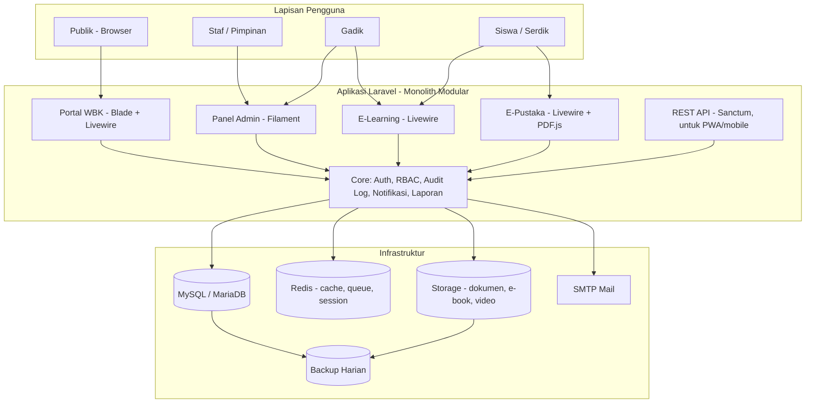

**Pola arsitektur**: *Modular Monolith* — satu aplikasi Laravel dengan pemisahan per domain (modul). Dipilih karena cocok untuk tim kecil & tenggat 2 bulan, mudah di-deploy, namun tetap rapi dan dapat dipecah di masa depan.

---

## 3. Peta Modul

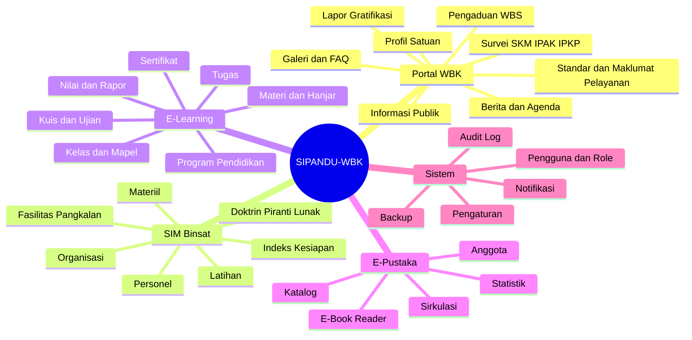

---

## 4. Aktor & Matriks Hak Akses

**Keterangan**: C = Create, R = Read, U = Update, D = Delete, A = Approve, — = tanpa akses

| Modul | Super Admin | Pimpinan | Operator Binsat | Gadik | Siswa | Pustakawan | Tim ZI | Publik |
|-------|:-----------:|:--------:|:---------------:|:-----:|:-----:|:----------:|:------:|:------:|
| Pengguna & Role | CRUD | R | — | — | — | — | — | — |
| Binsat (6 komponen) | CRUD | R, A | CRU* | R** | — | — | — | — |
| Dashboard Indeks Binsat | R | R | R* | — | — | — | — | — |
| E-Learning (kelola) | CRUD | R | — | CRUD | — | — | — | — |
| E-Learning (belajar) | R | R | — | R | R, C*** | — | — | — |
| E-Pustaka (kelola) | CRUD | R | — | C (usul) | — | CRUD | — | — |
| E-Pustaka (baca/pinjam) | R | R | R | R | R | R | R | R (katalog) |
| Konten Portal | CRUD | R | — | — | — | — | CRUD | R |
| Pengaduan / Gratifikasi | R | R, A | — | C | C | C | CRUD, A | C |
| Survei | CRUD | R | C | C | C | C | CRUD | C |
| Audit Log | R | R | — | — | — | — | R | — |

\* Hanya komponen sesuai seksinya (mis. Staf Pers → Personel) · \*\* Gadik membaca doktrin & jadwal latihan · \*\*\* Siswa mengirim jawaban & tugas

---

## 5. Rincian Modul

### 5.1 Portal WBK (Publik)

| Fitur | Deskripsi | Area ZI |
|-------|-----------|---------|
| Beranda | Hero, statistik layanan, berita terbaru, banner "Zona Integritas" | 1 |
| Profil | Sejarah, visi-misi, struktur organisasi, pejabat | 2 |
| Berita & Agenda | Kegiatan satuan, agenda ZI | 1 |
| Standar Pelayanan | Persyaratan, prosedur, waktu, biaya (Rp0), produk layanan | 6 |
| Maklumat Pelayanan | Janji layanan pimpinan | 6 |
| Informasi Publik (PPID) | Info berkala, serta-merta, setiap saat; permohonan informasi | 2 |
| Pengaduan / WBS | Form pengaduan (bisa anonim), nomor tiket, lacak status | 5, 6 |
| Lapor Gratifikasi | Form pelaporan penerimaan/penolakan gratifikasi | 5 |
| Survei | SKM (9 unsur), IPAK, IPKP — hasil ditampilkan publik | 6 |
| Inovasi | Etalase inovasi pelayanan | 1 |
| Galeri, FAQ, Kontak | — | 6 |

**Alur Pengaduan (WBS)**

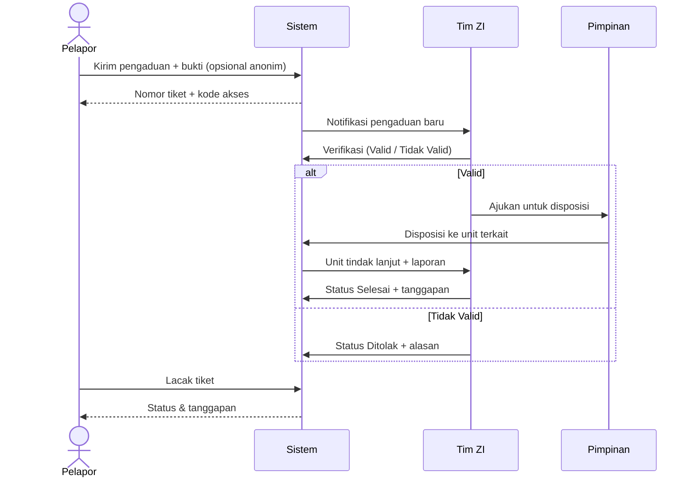

SLA: verifikasi ≤ 3 hari kerja, tindak lanjut ≤ 14 hari kerja (dapat dikonfigurasi). Sistem memberi tanda merah jika melewati SLA.

---

### 5.2 SIM Binsat — 6 Komponen

#### 5.2.1 Pembinaan Organisasi
| Fitur | Data / Fungsi |
|-------|---------------|
| Data Satuan & Sub-satuan | Rindam → Dodik/Depo/Detasemen → Seksi/Urusan (struktur pohon) |
| TOP/DSPP | Daftar jabatan menurut TOP: nama jabatan, pangkat, korps, jumlah |
| Struktur Riil | Jabatan yang terisi vs TOP → otomatis hitung *gap* |
| Bagan Organisasi | Org-chart otomatis dari data |
| Dokumen Organisasi | Surat keputusan pembentukan/perubahan organisasi |

#### 5.2.2 Pembinaan Personel
| Fitur | Data / Fungsi |
|-------|---------------|
| Data Personel | NRP, nama, pangkat, korps, jabatan, satuan, TMT, pendidikan, kontak (data sensitif terenkripsi) |
| Kekuatan Personel | Rekap per satuan/pangkat/golongan: DSPP vs Nyata (+/−) |
| Pemenuhan Jabatan | Jabatan kosong, rangkap, Plt |
| Riwayat | Pangkat, jabatan, pendidikan, penugasan, tanda jasa |
| Kesiapan Harian | Hadir, dinas luar, cuti, sakit, pendidikan |
| Moril Prajurit | Survei moril berkala, kegiatan pembinaan mental/olahraga, penghargaan & hukuman |
| Laporan | Lapsat personel, kekuatan bulanan (PDF/Excel) |

#### 5.2.3 Pembinaan Materiil
| Fitur | Data / Fungsi |
|-------|---------------|
| Inventaris | Kode, nama, kategori (senjata, munisi*, ranmor, alkom, alins/alongins, perlengkapan), nomor seri, satuan pemegang |
| Kondisi | B (Baik), RR (Rusak Ringan), RB (Rusak Berat) |
| Pemeliharaan | Jadwal harwat (harian/mingguan/bulanan), riwayat, petugas, biaya |
| Mutasi Materiil | Penerimaan, distribusi, penghapusan (dengan approval) |
| QR Code | Label QR per item → scan untuk lihat detail & kondisi |
| Laporan | Rekap kondisi & kesiapan materiil per kategori |

\* Data munisi/senjata yang rinci dan berklasifikasi dapat dibatasi hanya rekap jumlah sesuai kebijakan satuan.

#### 5.2.4 Pembinaan Fasilitas / Pangkalan
| Fitur | Data / Fungsi |
|-------|---------------|
| Aset Fasilitas | Gedung kantor, kelas, barak, rumah dinas, lapangan, lapangan tembak, sarana ibadah/olahraga |
| Kondisi & Kapasitas | Kondisi B/RR/RB, luas, kapasitas, foto |
| Rumah Dinas | Penghuni, SIP (Surat Izin Penghunian), masa berlaku |
| Permintaan Perbaikan | Tiket kerusakan → verifikasi → pengerjaan → selesai |
| Pemakaian Fasilitas | Peminjaman ruang/lapangan dengan kalender (cegah bentrok jadwal) |

#### 5.2.5 Pembinaan Latihan
| Fitur | Data / Fungsi |
|-------|---------------|
| Program Latihan | Program tahunan → bulanan → mingguan (bertahap, bertingkat, berlanjut) |
| Jenis Latihan | Latihan perorangan, satuan, menembak, jasmani (UTJ), Garjas, dsb. |
| Jadwal & Peserta | Kalender, peserta, pelatih, lokasi (terhubung modul Fasilitas) |
| Hasil Latihan | Nilai per peserta (mis. nilai menembak, Garjas A/B), dokumentasi |
| Evaluasi | % program terlaksana vs rencana, rata-rata hasil |

#### 5.2.6 Pembinaan Doktrin / Piranti Lunak
| Fitur | Data / Fungsi |
|-------|---------------|
| Repositori Naskah | Bujuk, Bujukmin, Juknis, Protap, SOP, Hanjar — dengan nomor, tahun, status berlaku |
| Versi Naskah | Riwayat revisi; naskah lama otomatis ditandai "Dicabut/Tidak Berlaku" |
| Klasifikasi Akses | Biasa / Terbatas (Rahasia **tidak** diunggah) |
| Sosialisasi | Jadwal sosialisasi + daftar hadir |
| Tes Pemahaman | Kuis pemahaman naskah (memakai mesin kuis E-Learning) |
| Bukti Baca | Tercatat siapa yang telah membaca naskah wajib |

#### 5.2.7 Indeks Kesiapan Binsat (Fitur Unggulan)

Setiap komponen menghasilkan skor 0–100 yang dihitung otomatis. **Bobot & rumus dapat dikonfigurasi** oleh Super Admin agar sesuai ketentuan resmi.

| Komponen | Rumus Awal (Draf) | Bobot Default |
|----------|-------------------|:-------------:|
| Organisasi | (Jabatan terbentuk sesuai TOP / Jabatan TOP) × 100 | 15% |
| Personel | 60% × Pemenuhan jabatan + 20% × Kesiapan harian + 20% × Indeks moril | 20% |
| Materiil | ((B × 1) + (RR × 0,5) + (RB × 0)) / Total item × 100 | 20% |
| Fasilitas | ((B × 1) + (RR × 0,5) + (RB × 0)) / Total fasilitas × 100 | 15% |
| Latihan | 70% × (Latihan terlaksana / Rencana) + 30% × Rata-rata nilai | 20% |
| Doktrin | 50% × Naskah mutakhir + 50% × Rata-rata tes pemahaman | 10% |

```
Indeks Kesiapan Binsat = Σ (Skor Komponen × Bobot)

≥ 85      : SIAP           (hijau)
70 – 84,9 : CUKUP SIAP     (kuning)
< 70      : KURANG SIAP    (merah)
```

Dashboard menampilkan: *gauge* indeks total, *radar chart* 6 komponen, tren bulanan, dan daftar "titik lemah" yang perlu ditindaklanjuti.

---

### 5.3 E-Learning (LMS)

| Fitur | Deskripsi |
|-------|-----------|
| Program Pendidikan | Mis. Diktukba, Diktukta, Dikjur, Bela Negara — angkatan, periode |
| Kelas / Peleton | Siswa dikelompokkan per kelas/peleton |
| Mata Pelajaran | Kurikulum, jam pelajaran (JP), gadik pengampu |
| Materi | PDF/hanjar (ditautkan dari E-Pustaka), video, tautan, teks; dibuka bertahap (*drip*) |
| Bank Soal | Pilihan ganda, benar/salah, esai; kategori & tingkat kesulitan |
| Kuis & Ujian | Acak soal & opsi, timer, batas percobaan, mode ujian layar penuh, penilaian otomatis |
| Tugas | Unggah berkas, tenggat, penilaian & umpan balik |
| Presensi | Presensi daring per sesi |
| Nilai & Rapor | Bobot nilai (tugas, kuis, UTS, UAS, praktik), rapor otomatis, ranking |
| Progres | Persentase penyelesaian materi per siswa |
| Sertifikat | Sertifikat PDF dengan QR verifikasi |
| Forum | Diskusi per mapel (opsional) |

**Alur Ujian Daring**

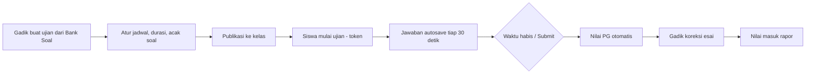

---

### 5.4 E-Pustaka (Digital Library)

| Fitur | Deskripsi |
|-------|-----------|
| Katalog | Judul, pengarang, penerbit, tahun, ISBN, kategori (DDC sederhana), sampul, lokasi rak |
| Koleksi Digital | E-book/PDF/hanjar dibaca di *viewer* (PDF.js) **tanpa tombol unduh**, watermark nama & NRP pembaca |
| Koleksi Fisik | Eksemplar dengan barcode/QR |
| Sirkulasi | Pinjam, kembali, perpanjang, reservasi, denda/sanksi keterlambatan |
| Keanggotaan | Otomatis dari data personel & siswa; kartu anggota digital |
| Pencarian | Pencarian *full-text* (judul, pengarang, kata kunci) |
| Fitur Pembaca | Bookmark, riwayat baca, koleksi favorit |
| Statistik | Buku terpopuler, pembaca teraktif, kunjungan |
| Usulan Buku | Gadik/siswa mengusulkan pengadaan koleksi |

**Alur Peminjaman Buku Fisik**

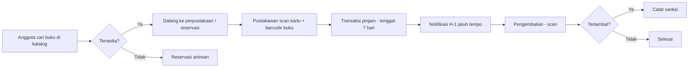

---

### 5.5 Modul Sistem
- **Manajemen Pengguna & Role** (Spatie Permission)
- **Audit Log** — mencatat siapa, kapan, data apa, nilai lama & baru (Spatie Activitylog) — bukti penguatan pengawasan ZI
- **Notifikasi** — in-app, email (opsional WhatsApp gateway)
- **Pengaturan** — identitas satuan, logo, bobot indeks Binsat, SLA pengaduan
- **Backup** — otomatis harian (database + file), retensi 30 hari

---

## 6. Rancangan Basis Data (ERD)

### 6.1 Core, Organisasi & Personel

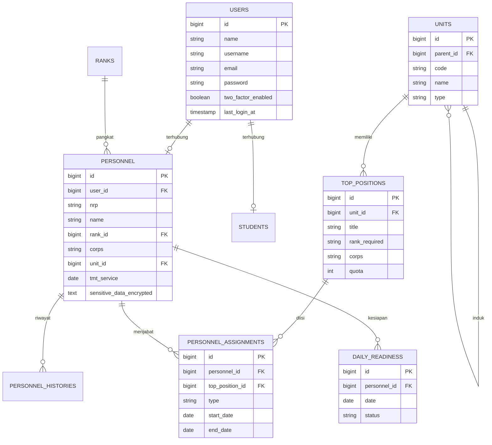

### 6.2 Materiil & Fasilitas

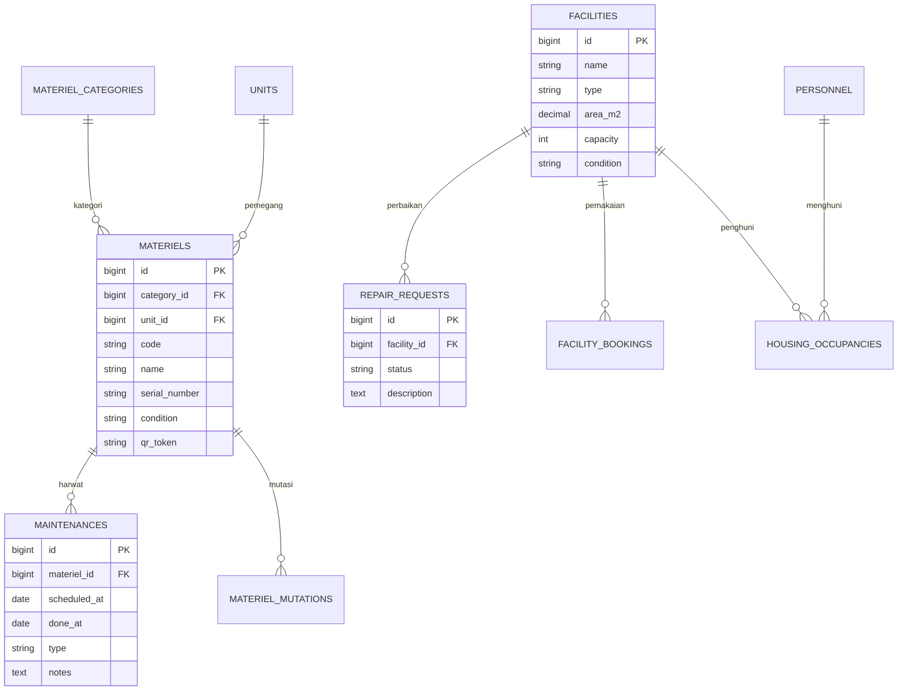

### 6.3 Latihan & Doktrin

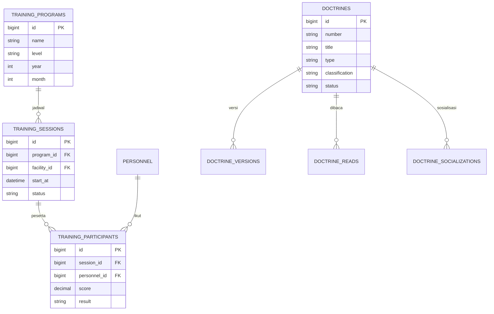

### 6.4 E-Learning

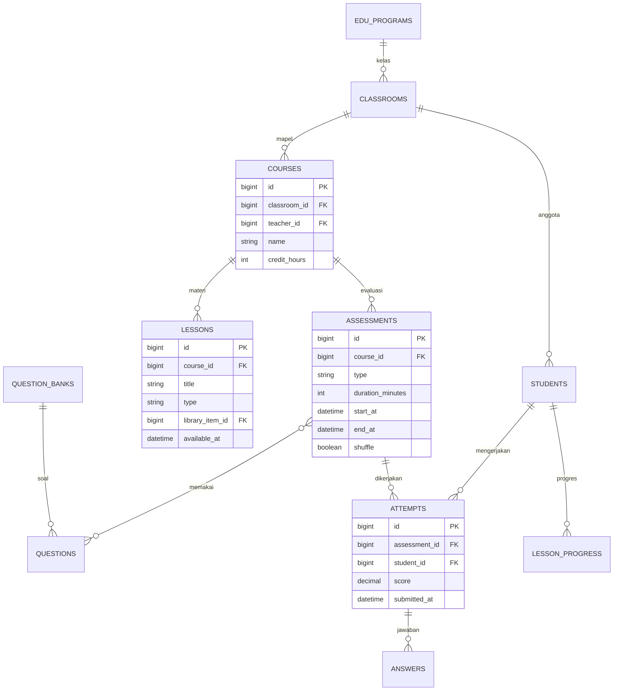

### 6.5 E-Pustaka & WBK

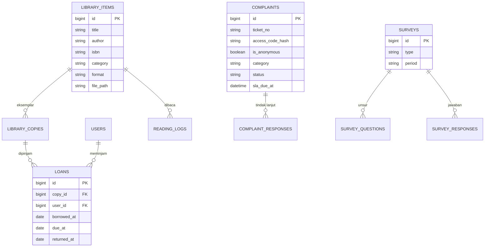

Tabel pendukung: `posts`, `pages`, `agendas`, `galleries`, `gratification_reports`, `public_info_requests`, `notifications`, `activity_log`, `settings`, `media`.

---

## 7. Sitemap / Struktur Menu

```
PUBLIK  (domain utama)
├── /                     Beranda
├── /profil               Sejarah, Visi-Misi, Struktur, Pejabat
├── /berita               Berita & Agenda
├── /zona-integritas      Program ZI, Inovasi, Maklumat, Standar Pelayanan
├── /informasi-publik     PPID
├── /pengaduan            Form + Lacak Tiket
├── /gratifikasi          Form Lapor Gratifikasi
├── /survei               SKM / IPAK / IPKP + Hasil
├── /pustaka              Katalog Publik (judul & ketersediaan)
└── /login

PANEL STAF  (/panel — Filament)
├── Dashboard Pimpinan (Indeks Binsat, statistik)
├── Binsat
│   ├── Organisasi   ├── Personel   ├── Materiil
│   ├── Fasilitas    ├── Latihan    └── Doktrin
├── Pendidikan (Program, Kelas, Siswa, Gadik)
├── Perpustakaan (Katalog, Eksemplar, Sirkulasi, Anggota)
├── Zona Integritas (Konten Portal, Pengaduan, Gratifikasi, Survei)
├── Laporan
└── Sistem (Pengguna, Role, Audit Log, Pengaturan, Backup)

E-LEARNING  (/belajar — Livewire, ramah mobile)
├── Beranda Siswa (jadwal, tugas tenggat, progres)
├── Kelas Saya → Mapel → Materi / Kuis / Tugas
├── Nilai & Sertifikat
└── Pustaka Digital (Reader)
```

---

## 8. Panduan Desain UI/UX

| Elemen | Ketentuan |
|--------|-----------|
| Warna Primer | Hijau Tentara `#3D5229` / Olive gelap `#2B3A1E` |
| Warna Aksen | Emas `#C9A227` (identitas militer & prestasi) |
| Netral | `#F5F5F0` (terang), `#1A1F16` (mode gelap) |
| Status | Hijau `#2E7D32` Siap · Kuning `#F9A825` Cukup · Merah `#C62828` Kurang |
| Tipografi | **Inter** (UI) & **Poppins/Montserrat** (judul) |
| Gaya | Bersih, formal, *card-based*, mode terang & gelap, ikon Heroicons |
| Aksesibilitas | Kontras WCAG AA, ukuran font ≥ 14px, navigasi keyboard |
| Responsif | Mobile-first untuk E-Learning & Portal; desktop-first untuk Panel Staf |

Wireframe/mockup dibuat pada Minggu 2 (Figma) untuk: Beranda Portal, Dashboard Pimpinan, Form Binsat, Halaman Kelas, Halaman Ujian, Reader E-Book.

---

## 9. Blueprint Keamanan

| Lapisan | Kontrol |
|---------|---------|
| Jaringan | HTTPS/TLS, firewall, Panel Staf idealnya hanya dapat diakses dari **intranet/VPN** |
| Autentikasi | Password kuat, 2FA (TOTP) untuk admin/pimpinan/operator, kunci akun setelah 5x gagal |
| Otorisasi | RBAC + *Policy* Laravel per model; filter data per satuan (*row-level*) |
| Data | Enkripsi kolom sensitif (`encrypted` cast), hash kode akses pengaduan, nama file acak |
| Aplikasi | CSRF, XSS escaping (Blade), Eloquent (anti SQLi), validasi tipe/ukuran file, *rate limiting* form publik, CAPTCHA |
| Konten Digital | Reader tanpa unduh, watermark dinamis, URL bertanda tangan (*signed URL*) berbatas waktu |
| Pengawasan | Audit log seluruh perubahan data, log login, alert aktivitas mencurigakan |
| Ketersediaan | Backup harian terenkripsi, uji restore bulanan |
| Keamanan Sistem | SIPANDU-WBK: otorisasi bertingkat, minimisasi data, audit trail hak akses |

---

## 10. Topologi Deployment

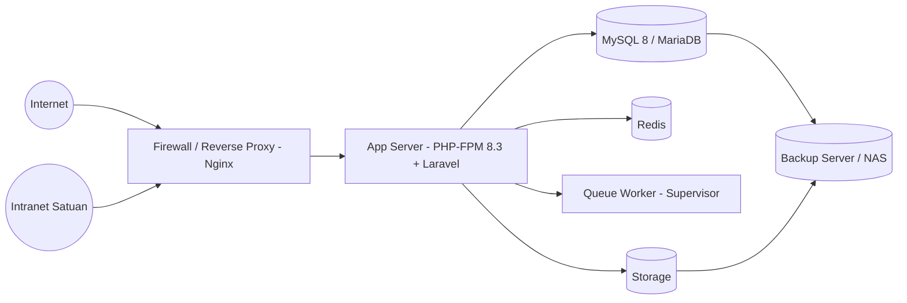

| Lingkungan | Keterangan |
|-----------|------------|
| **Local** | Laragon (Windows) — developer |
| **Staging** | Server uji untuk demo sprint & UAT |
| **Production** | Server satuan / data center Kodam / cloud pemerintah (sesuai kebijakan) |

Spesifikasi minimum server production: 4 vCPU, 8 GB RAM, 200 GB SSD (+ storage tambahan untuk video/e-book), Ubuntu Server 22.04/24.04 LTS.
