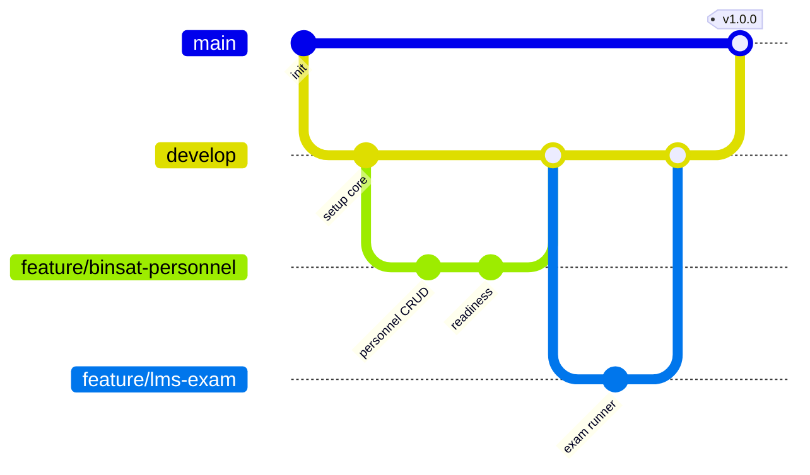

# KERANGKA KERJA TEKNIS — SIPANDU-WBK RINDAM

---

## 1. Technology Stack

| Lapisan | Teknologi | Alasan |
|---------|-----------|--------|
| Bahasa | **PHP 8.3+** | Performa & fitur modern (enum, readonly, typed property) |
| Framework | **Laravel (versi stabil terbaru, 12.x/13.x)** | Ekosistem matang, keamanan bawaan, produktif |
| Panel Admin | **Filament** (v4) | CRUD, tabel, form, filter, dashboard widget, MFA — hemat ±40% waktu pengembangan back-office |
| UI Interaktif | **Livewire 3 + Alpine.js** | Interaktif tanpa SPA terpisah; satu bahasa (PHP) |
| Styling | Tailwind CSS (bawaan Laravel/Filament) + tema kustom | Konsisten dengan Filament |
| Grafik | ApexCharts / Chart.js | Gauge, radar, tren Indeks Binsat |
| PDF Reader | **PDF.js** | Baca e-book tanpa unduh + watermark |
| Database | **MySQL 8 / MariaDB 10.6+** | Tersedia di Laragon & server produksi |
| Cache/Queue | Redis (produksi), `database` driver (lokal) | Antrean email, notifikasi, ekspor laporan |
| Pencarian | Laravel Scout (driver `database`; opsi Meilisearch) | Pencarian katalog & naskah |
| Build Tool | Vite | Bawaan Laravel |
| Testing | **Pest** + Laravel Dusk (opsional) | Unit, feature, browser test |
| Dev Env | **Laragon** (Windows) | Sudah digunakan |
| Server | Nginx + PHP-FPM + Supervisor, Ubuntu LTS | Standar produksi |
| VCS | Git + GitHub/GitLab (repositori **private**) | Kolaborasi & CI |

---

## 2. Daftar Package

### 2.1 Production
| Package | Fungsi |
|---------|--------|
| `filament/filament` | Panel staf/admin |
| `bezhansalleh/filament-shield` | UI manajemen role & permission untuk Filament |
| `spatie/laravel-permission` | RBAC |
| `spatie/laravel-activitylog` | Audit log (bukti pengawasan ZI) |
| `spatie/laravel-medialibrary` | Manajemen file (foto, dokumen, e-book) |
| `spatie/laravel-backup` | Backup database + file terjadwal |
| `maatwebsite/excel` | Impor/ekspor Excel (impor data personel awal, laporan) |
| `barryvdh/laravel-dompdf` | Cetak laporan, rapor, sertifikat PDF |
| `simplesoftwareio/simple-qrcode` | QR materiil, kartu anggota, verifikasi sertifikat |
| `laravel/sanctum` | Autentikasi API (PWA/mobile di masa depan) |
| `laravel/scout` | Pencarian *full-text* |
| `mews/captcha` atau Cloudflare Turnstile | CAPTCHA form publik |

### 2.2 Development
| Package | Fungsi |
|---------|--------|
| `pestphp/pest` + `pestphp/pest-plugin-laravel` | Testing |
| `laravel/pint` | Formatter PSR-12 |
| `larastan/larastan` | Analisis statis |
| `barryvdh/laravel-debugbar` | Debug lokal |
| `laravel/telescope` | Monitoring request/query lokal & staging |

---

## 3. Struktur Folder Proyek

```
rindam/
├── app/
│   ├── Enums/                    # Condition (B/RR/RB), ComplaintStatus, Classification, dll.
│   ├── Filament/
│   │   ├── Pages/                # Dashboard Pimpinan, Pengaturan Indeks
│   │   ├── Widgets/              # ReadinessGauge, ComponentRadar, ComplaintStats
│   │   └── Resources/
│   │       ├── Binsat/           # Unit, TopPosition, Personnel, Materiel, Facility,
│   │       │                     # TrainingProgram, Doctrine ...
│   │       ├── Education/        # EduProgram, Classroom, Student, Course
│   │       ├── Library/          # LibraryItem, LibraryCopy, Loan
│   │       ├── Wbk/              # Post, Complaint, Gratification, Survey
│   │       └── System/           # User, Setting
│   ├── Http/
│   │   ├── Controllers/          # Portal, Reader (signed URL), Certificate verify
│   │   ├── Middleware/
│   │   └── Requests/             # Form Request (validasi)
│   ├── Livewire/
│   │   ├── Portal/               # ComplaintForm, TrackTicket, SurveyForm
│   │   ├── Lms/                  # StudentDashboard, CoursePage, ExamRunner, AssignmentUpload
│   │   └── Library/              # Catalog, Reader
│   ├── Models/
│   │   ├── Binsat/  ├── Education/  ├── Library/  ├── Wbk/
│   │   └── User.php
│   ├── Policies/                 # Otorisasi per model
│   ├── Services/                 # Logika bisnis
│   │   ├── Binsat/ReadinessIndexService.php
│   │   ├── Education/GradingService.php
│   │   ├── Education/ExamService.php
│   │   ├── Library/CirculationService.php
│   │   └── Wbk/ComplaintService.php
│   ├── Exports/  ├── Imports/    # Excel
│   ├── Jobs/                     # GenerateReport, SendDueReminder, RecalculateIndex
│   ├── Notifications/
│   └── Observers/
├── config/
├── database/
│   ├── migrations/               # Prefix per modul: 2026_10_19_100000_create_units_table
│   ├── factories/
│   └── seeders/                  # RoleSeeder, RankSeeder, DemoDataSeeder
├── docs/                         # Dokumentasi proyek (folder ini)
├── resources/
│   ├── css/  ├── js/
│   └── views/
│       ├── components/           # Blade components (card, badge, stat)
│       ├── layouts/              # portal, lms
│       ├── portal/  ├── lms/  ├── library/
│       └── pdf/                  # Template laporan, rapor, sertifikat
├── routes/
│   ├── web.php                   # Portal publik
│   ├── lms.php                   # /belajar
│   ├── library.php               # /pustaka
│   └── api.php
├── storage/app/private/          # E-book & dokumen (TIDAK publik)
└── tests/
    ├── Feature/{Binsat,Education,Library,Wbk}/
    └── Unit/
```

---

## 4. Standar Pengkodean

| Aspek | Aturan |
|-------|--------|
| Bahasa kode | **Inggris** (class, method, tabel, kolom) — mis. `Personnel`, `materiels`, `due_at` |
| Bahasa UI | **Indonesia** (label, pesan, menu) via file `lang/id` |
| Style | PSR-12, dijalankan `vendor/bin/pint` sebelum commit |
| Tabel | `snake_case` jamak (`training_sessions`), FK `{model}_id` |
| Validasi | Wajib menggunakan Form Request / validasi Filament, tidak di controller |
| Logika bisnis | Di `Services/`, bukan di controller/Livewire |
| Otorisasi | Setiap model memiliki `Policy`; tidak ada pengecekan role *hardcoded* di view |
| Status/Konstanta | Gunakan PHP `Enum` |
| Query | Eager loading (`with()`) untuk cegah N+1; index pada kolom pencarian/FK |
| File | Disimpan di disk `private`, diakses via *signed URL* |
| Data sensitif | Cast `encrypted` di model |
| Soft Delete | Aktif untuk data master (personel, materiil, naskah) |
| Audit | Trait `LogsActivity` di semua model bisnis |

---

## 5. Alur Kerja Git



| Branch | Fungsi |
|--------|--------|
| `main` | Kode produksi (hanya dari `develop` atau `hotfix/*`) |
| `develop` | Integrasi, otomatis deploy ke **staging** |
| `feature/<modul>-<fitur>` | Pengembangan fitur |
| `hotfix/<deskripsi>` | Perbaikan darurat produksi |

**Konvensi commit** (*Conventional Commits*):
```
feat(binsat): tambah perhitungan indeks materiil
fix(lms): perbaiki timer ujian saat reload
docs: perbarui ERD e-pustaka
test(wbk): tambah test SLA pengaduan
```

**Pull Request**: minimal 1 reviewer, lulus Pint + Larastan + Pest (CI GitHub Actions/GitLab CI).

---

## 6. Definition of Done (DoD)

Sebuah fitur dinyatakan **selesai** jika:
- [ ] Sesuai *acceptance criteria* pada backlog
- [ ] Policy/otorisasi diterapkan & diuji
- [ ] Validasi input lengkap, pesan error berbahasa Indonesia
- [ ] Feature test untuk alur utama lulus
- [ ] Lolos Pint & Larastan
- [ ] Responsif (dicek di lebar 375px & 1366px)
- [ ] Aktivitas tercatat di audit log
- [ ] Sudah di-*review* dan di-merge ke `develop`
- [ ] Didemokan di Sprint Review

---

## 7. Setup Lingkungan Pengembangan (Laragon)

```powershell
# 1. Buat proyek (di d:\laragon\rindam)
composer create-project laravel/laravel .

# 2. Atur .env
#    APP_NAME="SIPANDU-WBK"  APP_LOCALE=id  APP_TIMEZONE=Asia/Jakarta
#    DB_CONNECTION=mysql  DB_DATABASE=rindam  DB_USERNAME=root  DB_PASSWORD=

# 3. Package inti
composer require filament/filament spatie/laravel-permission spatie/laravel-activitylog `
  spatie/laravel-medialibrary spatie/laravel-backup maatwebsite/excel `
  barryvdh/laravel-dompdf simplesoftwareio/simple-qrcode laravel/scout
composer require bezhansalleh/filament-shield

# 4. Package development
composer require --dev pestphp/pest pestphp/pest-plugin-laravel larastan/larastan barryvdh/laravel-debugbar

# 5. Instalasi
php artisan filament:install --panels      # ID panel: panel
php artisan vendor:publish --provider="Spatie\Permission\PermissionServiceProvider"
php artisan vendor:publish --provider="Spatie\Activitylog\ActivitylogServiceProvider" --tag="activitylog-migrations"
php artisan migrate
php artisan shield:install panel
php artisan make:filament-user

# 6. Frontend
npm install
npm run dev
```

Akses lokal: `http://rindam.test` (Portal) · `http://rindam.test/panel` (Panel Staf) · `http://rindam.test/belajar` (E-Learning)

---

## 8. Strategi Pengujian Teknis

| Level | Cakupan | Target |
|-------|---------|--------|
| Unit | `ReadinessIndexService`, `GradingService`, perhitungan denda, SLA | 100% service kritis |
| Feature | CRUD + policy per resource, alur pengaduan, alur ujian, sirkulasi | Alur utama tiap modul |
| Browser (opsional) | Ujian daring end-to-end | Skenario ujian |
| Beban | 200 user ujian serentak (k6) | p95 < 2 detik |
| Keamanan | OWASP ZAP baseline scan | 0 temuan High |

---

## 9. Operasional & Pemeliharaan

| Tugas | Frekuensi | Mekanisme |
|-------|-----------|-----------|
| Backup database + file | Harian 01.00 WIB | `spatie/laravel-backup` via scheduler |
| Hitung ulang Indeks Binsat | Harian 02.00 WIB + saat data berubah | Job `RecalculateIndex` |
| Pengingat jatuh tempo pinjaman | Harian 07.00 WIB | Job `SendDueReminder` |
| Peringatan SLA pengaduan | Setiap jam | Scheduler |
| Pembersihan log lama | Bulanan | `activitylog:clean` |
| Update keamanan dependensi | Bulanan | `composer audit` |
| Uji restore backup | Bulanan | Manual oleh admin |
