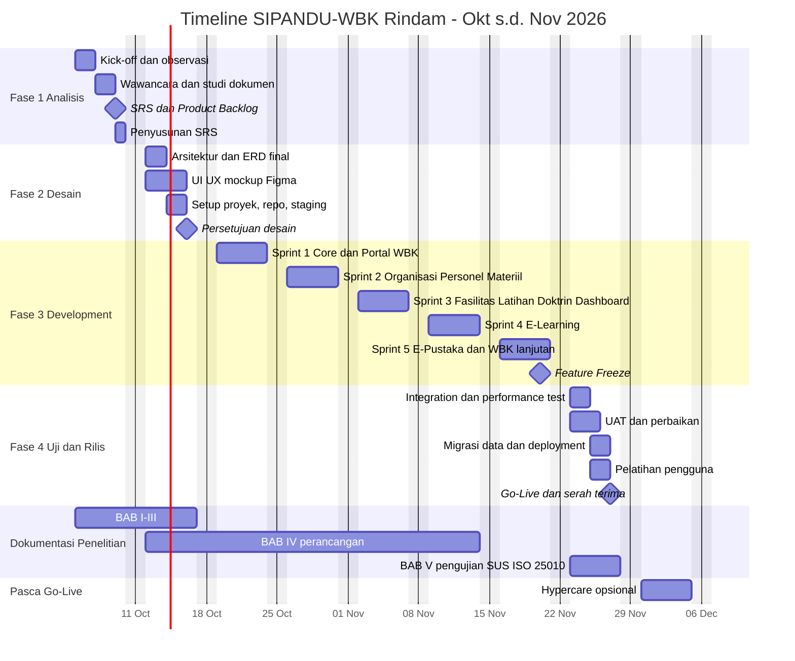
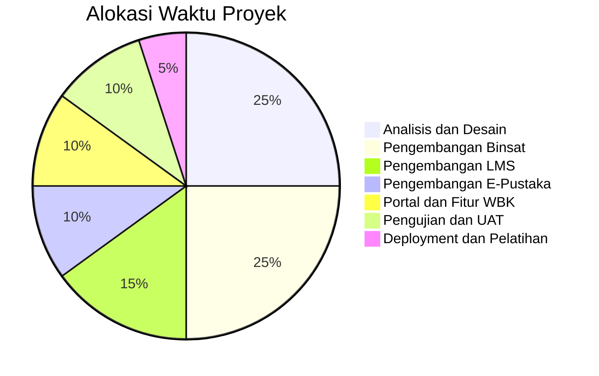

# TIMELINE PROYEK 2 BULAN — SIPANDU-WBK RINDAM

**Periode**: Senin, 5 Oktober 2026 – Jumat, 27 November 2026 (8 minggu / 40 hari kerja)
**Pendampingan opsional**: 30 November – 4 Desember 2026
**Metode**: Scrum, sprint 1 minggu (Senin–Jumat), demo setiap Jumat

---

## 1. Tim Proyek (Rekomendasi)

| Peran | Jumlah | Tanggung Jawab |
|-------|:------:|----------------|
| **Product Owner** (pejabat Rindam, mis. Kasi/Kabag terkait) | 1 | Menentukan prioritas, menyetujui hasil sprint, penanggung jawab UAT |
| **Project Manager / Scrum Master** | 1 | Jadwal, koordinasi, laporan kemajuan, hilangkan hambatan |
| **System Analyst / Peneliti** | 1 | Analisis kebutuhan, dokumentasi, instrumen penelitian |
| **Backend Developer** (Laravel) | 2 | Database, logika bisnis, Filament, API |
| **Frontend / UI Developer** | 1 | Desain UI, Portal, LMS, Reader (Livewire/Blade) |
| **QA / Tester** | 1 | Skenario uji, black-box, regresi |
| **Narahubung per seksi** (Pers, Log, Ops/Diklat, Perpus, Tim ZI) | 5 | Sumber data & penguji UAT |

> [!NOTE]
> Jika dikerjakan **1–2 developer**, pertahankan urutan sprint namun turunkan fitur berprioritas *Could* (forum, PWA, WhatsApp gateway) ke fase lanjutan dan manfaatkan Filament semaksimal mungkin.

---

## 2. Gantt Chart

---

## 3. Rincian Kegiatan Per Minggu

### 🔍 MINGGU 1 — Analisis Kebutuhan (5–9 Okt 2026)

| Hari | Kegiatan |
|------|----------|
| Sen | Kick-off meeting dengan pimpinan & narahubung; penetapan Product Owner, ruang lingkup, jalur komunikasi |
| Sel | Observasi proses Binsat di seksi Pers, Log, Ops/Diklat; observasi perpustakaan & Dodik |
| Rab | Wawancara pejabat, gadik, pustakawan, Tim ZI; kumpulkan format laporan, TOP/DSPP, contoh hanjar |
| Kam | Studi dokumen; kuesioner pra-implementasi; validasi rumus Indeks Binsat dengan pejabat |
| Jum | Penyusunan SRS & Product Backlog (prioritas MoSCoW); presentasi hasil analisis |

**Deliverable**: Dokumen SRS · Product Backlog · Data sampel (Excel) · BAB I–II draf
**Milestone M1**: ✅ SRS & Backlog disetujui Product Owner

---

### 🎨 MINGGU 2 — Desain Sistem & Setup (12–16 Okt 2026)

| Hari | Kegiatan |
|------|----------|
| Sen | Finalisasi arsitektur & ERD; mulai mockup Figma (Portal & Dashboard) |
| Sel | Data dictionary; mockup Form Binsat & Panel Staf |
| Rab | Setup repo Git, proyek Laravel, Filament, CI, server staging; mockup LMS & Reader |
| Kam | Seeder data master (pangkat, satuan, role); design system (warna, tipografi, komponen) |
| Jum | Review desain bersama Product Owner; revisi; Sprint 1 Planning |

**Deliverable**: ERD final · Mockup UI · Proyek berjalan di staging · BAB III draf
**Milestone M2**: ✅ Desain disetujui

---

### ⚙️ MINGGU 3 — Sprint 1: Core Sistem + Portal WBK (19–23 Okt 2026)

| Backlog | Detail |
|---------|--------|
| Autentikasi | Login, logout, reset password, 2FA, penguncian akun |
| RBAC | Role & permission (Filament Shield), pembatasan data per satuan |
| Audit Log | Activity log semua model, halaman log |
| Master Data | Satuan (pohon), pangkat, korps, kategori |
| Portal WBK | Beranda, profil, berita & agenda, standar & maklumat pelayanan, informasi publik, galeri, FAQ |
| Pengaturan | Identitas satuan, logo, kontak |

**Demo Jumat**: Portal publik dapat diakses, admin dapat login & mengelola konten
**Bukti ZI**: Portal ZI aktif sejak minggu ke-3 (bisa langsung dipakai sebagai bukti dukung)

---

### 🪖 MINGGU 4 — Sprint 2: Binsat Organisasi, Personel, Materiil (26–30 Okt 2026)

| Backlog | Detail |
|---------|--------|
| Organisasi | TOP/DSPP, struktur riil, gap analysis, bagan organisasi |
| Personel | Data personel (impor Excel), kekuatan DSPP vs nyata, pemenuhan jabatan, riwayat, kesiapan harian, moril |
| Materiil | Inventaris, kondisi B/RR/RB, jadwal harwat, mutasi + approval, label QR |
| Laporan | Ekspor PDF/Excel ketiga komponen |
| Uji | Feature test & black-box Sprint 2 |

**Demo Jumat**: Operator Pers & Log menginput data nyata; laporan kekuatan & kondisi materiil keluar otomatis

---

### 🏗️ MINGGU 5 — Sprint 3: Binsat Fasilitas, Latihan, Doktrin + Dashboard (2–6 Nov 2026)

| Backlog | Detail |
|---------|--------|
| Fasilitas | Aset fasilitas, rumah dinas & penghuni, tiket perbaikan, booking ruang/lapangan |
| Latihan | Program tahunan/bulanan, jadwal & peserta, hasil & evaluasi |
| Doktrin | Repositori naskah + versi + status berlaku, sosialisasi, bukti baca |
| Indeks Binsat | `ReadinessIndexService`, konfigurasi bobot, job hitung ulang |
| Dashboard Pimpinan | Gauge indeks, radar 6 komponen, tren, titik lemah |

**Demo Jumat**: Dashboard Pimpinan menampilkan Indeks Kesiapan Binsat dari data riil
**Milestone (internal)**: 🎯 SIM Binsat 6 komponen lengkap

---

### 🎓 MINGGU 6 — Sprint 4: E-Learning (9–13 Nov 2026)

| Backlog | Detail |
|---------|--------|
| Data Pendidikan | Program pendidikan, angkatan, kelas/peleton, siswa (impor Excel), gadik |
| Mata Pelajaran & Materi | PDF, video, tautan; pembukaan bertahap; progres siswa |
| Bank Soal | PG, benar/salah, esai; impor soal dari Excel |
| Kuis & Ujian | Token, timer, acak, autosave, penilaian otomatis, koreksi esai |
| Tugas & Presensi | Unggah tugas, penilaian, presensi daring |
| Nilai | Bobot nilai, rapor, sertifikat QR |
| Integrasi | Tes pemahaman Doktrin memakai mesin kuis LMS |

**Demo Jumat**: Gadik membuat kelas & ujian; siswa mengerjakan ujian dari ponsel; nilai otomatis

---

### 📚 MINGGU 7 — Sprint 5: E-Pustaka + WBK Lanjutan + Integrasi (16–20 Nov 2026)

| Backlog | Detail |
|---------|--------|
| E-Pustaka | Katalog, eksemplar & barcode, reader PDF.js + watermark, sirkulasi, denda/sanksi, kartu anggota, statistik, usulan buku |
| Integrasi LMS | Hanjar di E-Pustaka dapat dipasang sebagai materi kelas |
| Pengaduan / WBS | Form anonim, tiket, lacak, verifikasi, disposisi, SLA |
| Gratifikasi | Form pelaporan & pengelolaan |
| Survei | SKM, IPAK, IPKP + tampilan hasil publik |
| Notifikasi | In-app & email (pengaduan baru, tenggat tugas, jatuh tempo pinjaman) |
| Hardening | Rate limit, CAPTCHA, signed URL, review policy |

**Demo Jumat**: Seluruh modul terintegrasi
**Milestone M3**: ⛔ **Feature Freeze** — setelah ini hanya perbaikan bug

---

### ✅ MINGGU 8 — Pengujian, UAT, Deployment & Serah Terima (23–27 Nov 2026)

| Hari | Kegiatan |
|------|----------|
| Sen | Integration test; performance test (200 user ujian serentak); OWASP ZAP scan; UAT sesi 1 (Binsat) |
| Sel | UAT sesi 2 (LMS & Pustaka) & sesi 3 (Portal & WBK); perbaikan bug prioritas tinggi |
| Rab | Setup server produksi; migrasi data riil; backup terjadwal; pelatihan Operator Binsat & Tim ZI |
| Kam | Pelatihan Gadik, Siswa perwakilan, Pustakawan; pengisian kuesioner SUS & ISO 25010 |
| Jum | **Go-Live**; serah terima (kode sumber, kredensial, dokumentasi, manual); penandatanganan BA UAT |

**Deliverable**: Aplikasi produksi · Laporan pengujian · BA UAT · Manual pengguna (per role) · Manual admin & deployment · Video tutorial singkat · Hasil SUS & ISO 25010 (BAB V)
**Milestone M4**: 🚀 **Go-Live & Serah Terima**

---

### 🛟 (OPSIONAL) MINGGU 9 — Hypercare (30 Nov – 4 Des 2026)
Pendampingan harian, perbaikan bug pasca go-live, penyesuaian kecil, pemantauan kinerja server, finalisasi dokumen penelitian.

---

## 4. Ringkasan Milestone

| Kode | Milestone | Tanggal | Kriteria Penerimaan |
|------|-----------|---------|---------------------|
| M1 | SRS & Backlog disetujui | 9 Okt 2026 | Ditandatangani Product Owner |
| M2 | Desain disetujui | 16 Okt 2026 | Mockup & ERD disetujui, staging aktif |
| M2.5 | Portal WBK online (staging) | 23 Okt 2026 | Konten ZI dapat dikelola |
| M2.7 | SIM Binsat lengkap | 6 Nov 2026 | Indeks Binsat tampil dari data riil |
| M3 | Feature Freeze | 20 Nov 2026 | Semua backlog *Must* selesai |
| M4 | Go-Live & Serah Terima | 27 Nov 2026 | BA UAT ditandatangani, black-box ≥ 95% |

---

## 5. Seremoni Scrum Mingguan

| Seremoni | Waktu | Durasi | Peserta |
|----------|-------|--------|---------|
| Sprint Planning | Senin 08.00 | 1 jam | Tim + Product Owner |
| Daily Scrum | Setiap hari 08.00 (Sel–Jum) | 15 menit | Tim |
| Sprint Review (Demo) | Jumat 13.30 | 1 jam | Tim + Product Owner + narahubung |
| Retrospective | Jumat 15.00 | 30 menit | Tim |
| Laporan Mingguan ke Pimpinan | Jumat | 1 halaman | PM |

---

## 6. Alokasi Usaha (Estimasi)

---

## 7. Manajemen Risiko

| No | Risiko | Kemungkinan | Dampak | Mitigasi |
|----|--------|:-----------:|:------:|----------|
| 1 | Data riil (personel, materiil) terlambat diserahkan | Tinggi | Tinggi | Minta data sejak Minggu 1; siapkan template Excel impor; gunakan data dummy sementara |
| 2 | Perubahan kebutuhan di tengah sprint | Sedang | Tinggi | Perubahan masuk backlog sprint berikutnya; Product Owner tunggal yang memutuskan |
| 3 | Kesibukan dinas narahubung (latihan, upacara, pendidikan) | Tinggi | Sedang | Jadwal UAT disepakati sejak awal; tunjuk wakil narahubung |
| 4 | Klasifikasi keamanan data tidak jelas | Sedang | Tinggi | Tetapkan kebijakan klasifikasi di Minggu 1; data rahasia tidak masuk sistem |
| 5 | Infrastruktur server/jaringan belum siap | Sedang | Tinggi | Ajukan kebutuhan server di Minggu 2; siapkan staging cadangan |
| 6 | Kapasitas jaringan saat ujian serentak | Sedang | Sedang | Load test; ujian bergelombang; mode intranet |
| 7 | Rumus Indeks Binsat belum sesuai ketentuan resmi | Sedang | Sedang | Rumus & bobot dapat dikonfigurasi, divalidasi pejabat |
| 8 | Literasi digital pengguna beragam | Sedang | Sedang | UI sederhana, pelatihan per role, manual bergambar, video tutorial |
| 9 | Hak cipta e-book | Rendah | Sedang | Hanya unggah hanjar/naskah internal & koleksi berlisensi |
| 10 | Developer berhalangan | Rendah | Tinggi | Kode terdokumentasi, review silang, repositori terpusat |

---

## 8. Checklist Go-Live

**Teknis**
- [ ] `APP_ENV=production`, `APP_DEBUG=false`, `APP_KEY` baru
- [ ] HTTPS aktif, header keamanan (HSTS, CSP, X-Frame-Options)
- [ ] `php artisan optimize`, `config:cache`, `route:cache`, `view:cache`
- [ ] Queue worker (Supervisor) & scheduler (cron) berjalan
- [ ] Backup otomatis aktif + uji restore berhasil
- [ ] Panel `/panel` dibatasi intranet/VPN (sesuai kebijakan)
- [ ] Akun default/demo dihapus; password admin kuat + 2FA
- [ ] Hasil OWASP ZAP: 0 temuan High/Critical

**Data**
- [ ] Data master & data riil terimpor dan tervalidasi narahubung
- [ ] Akun pengguna dibuat & dibagikan secara aman

**Organisasi**
- [ ] BA UAT ditandatangani
- [ ] Seluruh role telah mengikuti pelatihan
- [ ] Admin sistem satuan ditunjuk & menerima serah terima
- [ ] SOP penggunaan sistem & penanganan pengaduan diterbitkan

---

## 9. Daftar Deliverable Akhir

| No | Deliverable | Format |
|----|-------------|--------|
| 1 | Aplikasi SIPANDU-WBK (produksi) | Web |
| 2 | Kode sumber + riwayat Git | Repositori |
| 3 | Dokumen Penelitian (BAB I–V) | DOCX/PDF |
| 4 | SRS, Blueprint, ERD, Data Dictionary | PDF |
| 5 | Laporan Pengujian (black-box, performa, keamanan, SUS, ISO 25010) | PDF |
| 6 | Manual Pengguna per role | PDF + video |
| 7 | Manual Administrator & Deployment | PDF |
| 8 | Berita Acara UAT & Serah Terima | Dokumen bertanda tangan |

---

## 10. Rencana Pengembangan Lanjutan (Pasca 2 Bulan)

| Fase | Fitur |
|------|-------|
| v1.1 | PWA (aplikasi ponsel tanpa install), notifikasi WhatsApp |
| v1.2 | Forum diskusi, gamifikasi belajar (badge, leaderboard) |
| v1.3 | Integrasi Single Sign-On dengan sistem Kodam/TNI AD (jika diizinkan) |
| v2.0 | Analitik prediktif (prediksi kelulusan siswa, prediksi kerusakan materiil) |
