# PETA RELASI ENTITAS BASIS DATA (ERD MAP) — SIPANDU-WBK RINDAM

> **Sistem Informasi Pembinaan Satuan Pendidikan Terpadu berbasis Wilayah Bebas dari Korupsi**  
> Dokumen ini memetakan seluruh arsitektur basis data relasional (*Relational Database Management System* - MySQL 8/MariaDB 10.6+) yang mencakup **5 Kluster Domain**, **45 Tabel Entitas**, hubungan kardinalitas, kamus data (*data dictionary*), serta integrasi lintas modul.

---

## 1. Peta Kluster Basis Data (5 Domain Arsitektur)

Sistem SIPANDU-WBK dirancang dengan konsep *Modular Monolith*. Basis data terbagi dalam 5 kluster logis yang saling terhubung melalui relasi kunci asing (*Foreign Key*):

```mermaid
flowchart TB
    subgraph C1["1. CORE & KEAMANAN"]
        U[(users)]
        R[(roles & permissions)]
        AL[(activity_log)]
        NOT[(notifications)]
        SET[(system_settings)]
    end

    subgraph C2["2. SIM BINSAT 6 KOMPONEN"]
        ORG["Organisasi: units, top_positions"]
        PERS["Personel: personnel, ranks, assignments, readiness, morale"]
        MAT["Materiil: materiels, categories, maintenances, mutations"]
        FAS["Fasilitas: facilities, repairs, housing, bookings"]
        LAT["Latihan: training_programs, sessions, participants"]
        DOK["Doktrin: doctrines, versions, reads, socializations"]
        IND["Indeks: readiness_weights, readiness_logs"]
    end

    subgraph C3["3. E-LEARNING (LMS)"]
        EDU["Pendidikan: edu_programs, classrooms, students"]
        CRS["Pembelajaran: courses, lessons, progress"]
        EXM["Evaluasi: question_banks, questions, assessments, attempts, answers"]
        GRD["Hasil: assignments, submissions, report_cards, certificates"]
    end

    subgraph C4["4. E-PUSTAKA (DIGITAL LIBRARY)"]
        CAT["Katalog: library_items, library_categories"]
        CIR["Sirkulasi: library_copies, library_loans, fines, reservations"]
        LOG["Literasi: reading_logs, book_proposals"]
    end

    subgraph C5["5. PORTAL WBK & ZONA INTEGRITAS"]
        WBS["WBS: complaints, complaint_actions"]
        GRAT["Integritas: gratification_reports, public_info_requests"]
        SRV["Survei: surveys, survey_questions, survey_responses"]
        CMS["Publikasi: portal_posts, service_standards, galleries"]
    end

    %% Integrasi Lintas Kluster
    U --> PERS
    U --> EDU
    U --> CIR
    U --> WBS
    U --> GRAT
    U --> AL

    ORG --> PERS
    ORG --> MAT
    ORG --> FAS
    ORG --> LAT

    FAS -.-> LAT
    FAS -.-> EDU
    PERS -.-> LAT
    PERS -.-> EDU

    CAT -.-> CRS
    CAT -.-> DOK
    EXM -.-> DOK

    ORG --> IND
    PERS --> IND
    MAT --> IND
    FAS --> IND
    LAT --> IND
    DOK --> IND
```

---

## 2. Diagram ERD Global Lintas Domain

Diagram di bawah ini menggambarkan relasi entitas utama dari kelima modul yang saling mengunci (*cross-domain foreign keys*):

```mermaid
erDiagram
    %% CORE RELATIONS
    USERS ||--o| PERSONNEL : "memiliki profil"
    USERS ||--o| STUDENTS : "memiliki akun siswa"
    USERS ||--o{ LIBRARY_LOANS : "meminjam buku"
    USERS ||--o{ COMPLAINT_ACTIONS : "menindaklanjuti"
    USERS ||--o{ GRATIFICATION_REPORTS : "melaporkan"
    USERS ||--o{ DOCTRINE_READS : "mencatat baca"

    %% BINSAT - ORGANISASI & PERSONEL
    UNITS ||--o{ UNITS : "sub-satuan"
    UNITS ||--o{ TOP_POSITIONS : "daftar jabatan TOP"
    UNITS ||--o{ PERSONNEL : "penempatan satuan"
    UNITS ||--o{ MATERIELS : "satuan pemegang"
    UNITS ||--o{ FACILITIES : "lokasi pangkalan"
    UNITS ||--o{ TRAINING_PROGRAMS : "program latihan"
    UNITS ||--o{ READINESS_CALCULATION_LOGS : "indeks Binsat"

    RANKS ||--o{ PERSONNEL : "tingkat kepangkatan"
    TOP_POSITIONS ||--o{ PERSONNEL_ASSIGNMENTS : "posisi jabatan"
    PERSONNEL ||--o{ PERSONNEL_ASSIGNMENTS : "riwayat penempatan"
    PERSONNEL ||--o{ PERSONNEL_HISTORIES : "rekam jejak"
    PERSONNEL ||--o{ DAILY_READINESS : "kesiapan harian"
    PERSONNEL ||--o{ HOUSING_OCCUPANCIES : "menghuni rumdis"
    PERSONNEL ||--o{ TRAINING_PARTICIPANTS : "mengikuti latihan"
    PERSONNEL ||--o{ COURSES : "gadik pengampu"

    %% BINSAT - MATERIIL & FASILITAS
    MATERIEL_CATEGORIES ||--o{ MATERIELS : "kategori bekal/alutsista"
    MATERIELS ||--o{ MATERIEL_MAINTENANCES : "riwayat harwat"
    MATERIELS ||--o{ MATERIEL_MUTATIONS : "riwayat mutasi/distribusi"
    FACILITIES ||--o{ FACILITY_REPAIR_REQUESTS : "permohonan perbaikan"
    FACILITIES ||--o{ FACILITY_BOOKINGS : "jadwal pemakaian"
    FACILITIES ||--o{ HOUSING_OCCUPANCIES : "hunian rumah dinas"
    FACILITIES ||--o{ TRAINING_SESSIONS : "lapangan/sarana latihan"

    %% BINSAT - LATIHAN & DOKTRIN
    TRAINING_PROGRAMS ||--o{ TRAINING_SESSIONS : "jadwal latihan"
    TRAINING_SESSIONS ||--o{ TRAINING_PARTICIPANTS : "rekap nilai peserta"
    DOCTRINES ||--o{ DOCTRINE_VERSIONS : "riwayat revisi naskah"
    DOCTRINES ||--o{ DOCTRINE_READS : "bukti baca naskah"
    DOCTRINES ||--o{ DOCTRINE_SOCIALIZATIONS : "sosialisasi naskah"
    ASSESSMENTS ||--o{ DOCTRINES : "evaluasi pemahaman doktrin"

    %% E-LEARNING
    EDU_PROGRAMS ||--o{ CLASSROOMS : "rombongan belajar/peleton"
    CLASSROOMS ||--o{ STUDENTS : "daftar serdik/siswa"
    CLASSROOMS ||--o{ COURSES : "kurikulum mapel"
    COURSES ||--o{ LESSONS : "materi/hanjar"
    LIBRARY_ITEMS ||--o{ LESSONS : "tautan sumber hanjar"
    COURSES ||--o{ ASSESSMENTS : "kuis dan ujian"
    QUESTION_BANKS ||--o{ QUESTIONS : "bank soal"
    QUESTIONS ||--o{ QUESTION_OPTIONS : "opsi pilihan ganda"
    ASSESSMENTS ||--o{ EXAM_ATTEMPTS : "sesi pengerjaan"
    STUDENTS ||--o{ EXAM_ATTEMPTS : "mengerjakan ujian"
    EXAM_ATTEMPTS ||--o{ EXAM_ANSWERS : "lembar jawaban"
    COURSES ||--o{ ASSIGNMENTS : "tugas terstruktur"
    ASSIGNMENTS ||--o{ ASSIGNMENT_SUBMISSIONS : "unggah tugas siswa"
    STUDENTS ||--o{ STUDENT_REPORT_CARDS : "rapor hasil didik"
    STUDENTS ||--o{ CERTIFICATES : "ijazah/sertifikat digital"

    %% E-PUSTAKA
    LIBRARY_CATEGORIES ||--o{ LIBRARY_ITEMS : "klasifikasi DDC"
    LIBRARY_ITEMS ||--o{ LIBRARY_COPIES : "eksemplar fisik"
    LIBRARY_COPIES ||--o{ LIBRARY_LOANS : "transaksi peminjaman"
    LIBRARY_LOANS ||--o| LIBRARY_FINES : "denda/sanksi keterlambatan"
    LIBRARY_ITEMS ||--o{ LIBRARY_READING_LOGS : "riwayat baca digital"
    LIBRARY_ITEMS ||--o{ LIBRARY_BOOK_RESERVATIONS : "antrean reservasi"

    %% WBK & ZONA INTEGRITAS
    COMPLAINTS ||--o{ COMPLAINT_ACTIONS : "tindak lanjut pengaduan/WBS"
    SURVEYS ||--o{ SURVEY_QUESTIONS : "indikator kepuasan"
    SURVEYS ||--o{ SURVEY_RESPONSES : "data responden SKM/IPAK/IPKP"
```

---

## 3. Rincian Kamus Data Per Kluster (Data Dictionary)

### 3.1 Kluster 1: Core & Keamanan Sistem

| Tabel | Kolom Utama | Tipe Data | Keterangan Relasi / Atribut |
|---|---|---|---|
| **`users`** | `id` (PK) `name` `username` (Unique) `email` (Unique) `password` `phone` `role_type` `two_factor_secret` `two_factor_confirmed_at` `is_active` `last_login_at` | BIGINT UNSIGNED VARCHAR(150) VARCHAR(50) VARCHAR(100) VARCHAR(255) VARCHAR(25) ENUM TEXT TIMESTAMP BOOLEAN TIMESTAMP | Akun akses terpusat seluruh role (Super Admin, Danrindam, Staf Binsat, Gadik, Siswa, Pustakawan, Tim ZI, Publik Terdaftar). Dilengkapi 2FA TOTP. |
| **`roles`** | `id` (PK) `name` `guard_name` | BIGINT UNSIGNED VARCHAR(50) VARCHAR(50) | Manajemen Peran Spatie Permission (`super_admin`, `pimpinan`, `operator_binsat`, `gadik`, `siswa`, `pustakawan`, `tim_zi`, `publik`). |
| **`permissions`** | `id` (PK) `name` `guard_name` | BIGINT UNSIGNED VARCHAR(100) VARCHAR(50) | Hak akses spesifik granular (contoh: `create_personnel`, `approve_mutation`, `view_readiness_index`). |
| **`activity_log`** | `id` (PK) `log_name` `description` `subject_type` `subject_id` `causer_type` `causer_id` (FK) `properties` `created_at` | BIGINT UNSIGNED VARCHAR(50) TEXT VARCHAR(100) BIGINT UNSIGNED VARCHAR(100) BIGINT UNSIGNED JSON TIMESTAMP | Jejak audit digital tak terhapuskan (*immutable audit trail*) untuk pemenuhan Area 5 ZI (Penguatan Pengawasan). |
| **`system_settings`** | `id` (PK) `key` (Unique) `value` `group` `description` | BIGINT UNSIGNED VARCHAR(100) TEXT VARCHAR(50) VARCHAR(255) | Konfigurasi sistem: batas SLA pengaduan, bobot Indeks Binsat, watermark viewer, informasi identitas satuan. |

---

### 3.2 Kluster 2: SIM Binsat 6 Komponen

#### A. Pembinaan Organisasi & Personel
| Tabel | Kolom Utama | Tipe Data | Keterangan Relasi / Atribut |
|---|---|---|---|
| **`units`** | `id` (PK) `parent_id` (FK nullable) `code` (Unique) `name` `type` `level` `is_active` | BIGINT UNSIGNED BIGINT UNSIGNED VARCHAR(30) VARCHAR(150) ENUM TINYINT BOOLEAN | Pohon struktur satuan (Rindam → Dodikjur/Dodiklatpur/Depo Pendidikan → Seksi/Urusan). Self-referencing ke `parent_id`. |
| **`top_positions`** | `id` (PK) `unit_id` (FK) `position_name` `rank_required` `corps_required` `quota_top` `notes` | BIGINT UNSIGNED BIGINT UNSIGNED VARCHAR(150) VARCHAR(50) VARCHAR(30) INT UNSIGNED TEXT | Daftar formasi jabatan resmi menurut TOP/DSPP yang disahkan pimpinan TNI AD. |
| **`ranks`** | `id` (PK) `code` `name` `category` `order_level` | BIGINT UNSIGNED VARCHAR(20) VARCHAR(100) ENUM TINYINT | Standar kepangkatan militer (Pamen, Pama, Bintara Tinggi, Bintara, Tamtama, PNS). |
| **`personnel`** | `id` (PK) `user_id` (FK nullable) `nrp` (Unique) `full_name` `rank_id` (FK) `corps` `unit_id` (FK) `birth_date` `tmt_service` `tmt_rank` `sensitive_data_encrypted` `photo_path` `status` | BIGINT UNSIGNED BIGINT UNSIGNED VARCHAR(30) VARCHAR(150) BIGINT UNSIGNED VARCHAR(30) BIGINT UNSIGNED DATE DATE DATE TEXT VARCHAR(255) ENUM | Master data prajurit/pegawai organik. Data rahasia/sensitif (NIK, riwayat kesehatan, gaji) dienkripsi dengan AES-256 (`encrypted` cast). |
| **`personnel_assignments`** | `id` (PK) `personnel_id` (FK) `top_position_id` (FK) `assignment_type` `sk_number` `start_date` `end_date` `is_current` | BIGINT UNSIGNED BIGINT UNSIGNED BIGINT UNSIGNED ENUM VARCHAR(100) DATE DATE nullable BOOLEAN | Riwayat pemenuhan formasi jabatan. Menghitung otomatis kesesuaian Nyata vs TOP dan jabatan kosong/rangkap. |
| **`daily_readiness`** | `id` (PK) `personnel_id` (FK) `unit_id` (FK) `date` `status` `notes` | BIGINT UNSIGNED BIGINT UNSIGNED BIGINT UNSIGNED DATE ENUM VARCHAR(255) | Kesiapan harian prajurit: `Hadir`, `Dinas Luar`, `Cuti`, `Sakit`, `Pendidikan`, `Tanpa Keterangan`. Dihitung setiap apel pagi. |
| **`morale_records`** | `id` (PK) `unit_id` (FK) `period` `activity_type` `participant_count` `morale_score` `documentation_path` | BIGINT UNSIGNED BIGINT UNSIGNED VARCHAR(7) ENUM INT UNSIGNED DECIMAL(5,2) VARCHAR(255) | Pembinaan moril prajurit: kegiatan ibadah/bintal, olahraga gabungan, rekam penghargaan & penegakan disiplin. |

#### B. Pembinaan Materiil & Fasilitas Pangkalan
| Tabel | Kolom Utama | Tipe Data | Keterangan Relasi / Atribut |
|---|---|---|---|
| **`materiel_categories`** | `id` (PK) `code` `name` `type` `description` | BIGINT UNSIGNED VARCHAR(20) VARCHAR(100) ENUM TEXT | Klasifikasi bekal/logistik: `Senjata`, `Munisi`, `Kendaraan Bermotor`, `Alat Komunikasi`, `Alins/Alongins`, `Perlengkapan Perorangan`. |
| **`materiels`** | `id` (PK) `category_id` (FK) `unit_id` (FK) `code` (Unique) `name` `serial_number` `acquisition_year` `condition` `is_operational` `qr_code_token` `notes` | BIGINT UNSIGNED BIGINT UNSIGNED BIGINT UNSIGNED VARCHAR(50) VARCHAR(150) VARCHAR(100) YEAR ENUM('B','RR','RB') BOOLEAN VARCHAR(64) TEXT | Inventaris materiil. Dilengkapi kode token QR untuk pemindaian fisik dan kondisi kesiapan operasional. |
| **`materiel_maintenances`** | `id` (PK) `materiel_id` (FK) `scheduled_date` `completed_date` `maintenance_type` `technician_name` `cost` `condition_after` `notes` | BIGINT UNSIGNED BIGINT UNSIGNED DATE DATE nullable VARCHAR(100) VARCHAR(100) DECIMAL(14,2) ENUM('B','RR','RB') TEXT | Rekam pemeliharaan dan perawatan (Harwat) terjadwal maupun insidentil. |
| **`materiel_mutations`** | `id` (PK) `materiel_id` (FK) `from_unit_id` (FK) `to_unit_id` (FK) `sk_number` `mutation_date` `status` `approved_by` (FK) | BIGINT UNSIGNED BIGINT UNSIGNED BIGINT UNSIGNED BIGINT UNSIGNED VARCHAR(100) DATE ENUM BIGINT UNSIGNED | Riwayat penerimaan, pergeseran logistik antar-seksi/dodik, hingga penghapusan bekal. |
| **`facilities`** | `id` (PK) `unit_id` (FK) `code` (Unique) `name` `facility_type` `area_m2` `capacity` `condition` `photo_path` `address` | BIGINT UNSIGNED BIGINT UNSIGNED VARCHAR(50) VARCHAR(150) ENUM DECIMAL(10,2) INT UNSIGNED ENUM('B','RR','RB') VARCHAR(255) TEXT | Pangkalan militer: Markas Komando, barak serdik, kelas belajar, rumah dinas prajurit, lapangan tembak, lapangan upacara. |
| **`facility_repair_requests`**| `id` (PK) `facility_id` (FK) `reported_by` (FK) `description` `photo_damage_path` `urgency` `status` `cost_estimate` | BIGINT UNSIGNED BIGINT UNSIGNED BIGINT UNSIGNED TEXT VARCHAR(255) ENUM ENUM DECIMAL(14,2) | Tiket kerusakan fasilitas fisik: diajukan → diverifikasi Pejabat Logistik → dikerjakan Staf Fasjas → diselesaikan. |
| **`housing_occupancies`** | `id` (PK) `facility_id` (FK) `personnel_id` (FK) `sip_number` `start_date` `end_date` `status` `family_count` | BIGINT UNSIGNED BIGINT UNSIGNED BIGINT UNSIGNED VARCHAR(100) DATE DATE nullable ENUM TINYINT | Tertib penghunian Rumah Dinas (Rumdis) berbasis Surat Izin Penghunian (SIP) resmi. |
| **`facility_bookings`** | `id` (PK) `facility_id` (FK) `booked_by` (FK) `purpose` `start_time` `end_time` `status` | BIGINT UNSIGNED BIGINT UNSIGNED BIGINT UNSIGNED VARCHAR(200) DATETIME DATETIME ENUM | Peminjaman fasilitas umum/kelas/lapangan dengan kalender bentrok jadwal otomatis. |

#### C. Pembinaan Latihan, Doktrin, dan Indeks Kesiapan
| Tabel | Kolom Utama | Tipe Data | Keterangan Relasi / Atribut |
|---|---|---|---|
| **`training_programs`** | `id` (PK) `unit_id` (FK) `name` `level` `year` `quarter` `target_participants` `description` | BIGINT UNSIGNED BIGINT UNSIGNED VARCHAR(150) ENUM YEAR TINYINT INT UNSIGNED TEXT | Rencana program latihan (Renlat) bertahap, bertingkat, berlanjut: Latihan Perorangan Dasar (Latorsar), UTJ, Menembak, Garjas. |
| **`training_sessions`** | `id` (PK) `program_id` (FK) `facility_id` (FK) `instructor_personnel_id` (FK) `title` `start_at` `end_at` `status` | BIGINT UNSIGNED BIGINT UNSIGNED BIGINT UNSIGNED BIGINT UNSIGNED VARCHAR(150) DATETIME DATETIME ENUM | Pelaksanaan sesi latihan terhubung ke modul Fasilitas (lokasi) dan Personel (pelatih). |
| **`training_participants`** | `id` (PK) `session_id` (FK) `personnel_id` (FK) `attendance` `theory_score` `practice_score` `final_score` `result` | BIGINT UNSIGNED BIGINT UNSIGNED BIGINT UNSIGNED BOOLEAN DECIMAL(5,2) DECIMAL(5,2) DECIMAL(5,2) ENUM('Lulus','TidakLulus') | Penilaian kemampuan perorangan hasil latihan fisik, taktik, dan ketangkasan militer. |
| **`doctrines`** | `id` (PK) `document_number` `title` `doctrine_type` `classification` `year` `issuing_authority` `status` `assessment_id` (FK nullable) | BIGINT UNSIGNED VARCHAR(100) VARCHAR(200) ENUM ENUM('Biasa','Terbatas') YEAR VARCHAR(100) ENUM('Berlaku','Dicabut') BIGINT UNSIGNED | Repositori Doktrin, Bujuk, Juknis, Protap, dan SOP dinas. Terhubung ke kuis evaluasi LMS untuk uji pemahaman. |
| **`doctrine_versions`** | `id` (PK) `doctrine_id` (FK) `version_number` `revision_notes` `file_path` `effective_date` `uploaded_by` (FK) | BIGINT UNSIGNED BIGINT UNSIGNED VARCHAR(20) TEXT VARCHAR(255) DATE BIGINT UNSIGNED | Riwayat amandemen naskah dinas agar prajurit selalu mengacu pada versi naskah terbitan mutakhir. |
| **`doctrine_reads`** | `id` (PK) `doctrine_id` (FK) `user_id` (FK) `read_at` `duration_seconds` `ip_address` | BIGINT UNSIGNED BIGINT UNSIGNED BIGINT UNSIGNED TIMESTAMP INT UNSIGNED VARCHAR(45) | Bukti kepatuhan literasi doktrin militer oleh segenap prajurit. |
| **`readiness_weight_configs`**| `id` (PK) `component_name` (Unique) `weight_percentage` `formula_code` `is_active` | BIGINT UNSIGNED VARCHAR(50) DECIMAL(5,2) VARCHAR(100) BOOLEAN | Konfigurasi bobot komponen Binsat (Organisasi 15%, Pers 20%, Mat 20%, Fas 15%, Lat 20%, Dok 10%). |
| **`readiness_calculation_logs`**| `id` (PK) `unit_id` (FK) `period_date` `org_score` `pers_score` `mat_score` `fas_score` `lat_score` `dok_score` `total_index` `status` `calculated_at` | BIGINT UNSIGNED BIGINT UNSIGNED DATE DECIMAL(5,2) DECIMAL(5,2) DECIMAL(5,2) DECIMAL(5,2) DECIMAL(5,2) DECIMAL(5,2) DECIMAL(5,2) ENUM('SIAP','CUKUP','KURANG') TIMESTAMP | Arsip rekam nilai Indeks Kesiapan Satuan untuk tren visual radar chart dan laporan wasrik. |

---

### 3.3 Kluster 3: E-Learning (Learning Management System)

| Tabel | Kolom Utama | Tipe Data | Keterangan Relasi / Atribut |
|---|---|---|---|
| **`education_programs`** | `id` (PK) `code` (Unique) `name` `category` `batch_number` `year` `start_date` `end_date` `is_active` | BIGINT UNSIGNED VARCHAR(30) VARCHAR(150) ENUM VARCHAR(20) YEAR DATE DATE BOOLEAN | Program pendidikan resmi: Diktukba, Diktukta, Dikjur Ba/Ta, Pendidikan Bela Negara, dsb. |
| **`classrooms`** | `id` (PK) `program_id` (FK) `code` (Unique) `name` `platoon_name` `commander_personnel_id` (FK) `capacity` | BIGINT UNSIGNED BIGINT UNSIGNED VARCHAR(30) VARCHAR(100) VARCHAR(50) BIGINT UNSIGNED INT UNSIGNED | Rombongan belajar per kelas / kompi / peleton serdik dengan Komandan Peleton pengasuh. |
| **`students`** | `id` (PK) `user_id` (FK nullable) `classroom_id` (FK) `nosik` (Unique) `full_name` `rank` `origin_unit` `status` `photo_path` | BIGINT UNSIGNED BIGINT UNSIGNED BIGINT UNSIGNED VARCHAR(30) VARCHAR(150) VARCHAR(50) VARCHAR(100) ENUM VARCHAR(255) | Data induk serdik/siswa siswa pendidikan. Terhubung ke akun pengguna untuk login LMS. |
| **`courses`** | `id` (PK) `classroom_id` (FK) `instructor_personnel_id` (FK) `code` `name` `credit_hours_jp` `passing_grade` `description` | BIGINT UNSIGNED BIGINT UNSIGNED BIGINT UNSIGNED VARCHAR(30) VARCHAR(150) INT UNSIGNED DECIMAL(5,2) TEXT | Mata Pelajaran (Mapel) yang diajarkan oleh Gadik pengampu. |
| **`lessons`** | `id` (PK) `course_id` (FK) `library_item_id` (FK nullable) `title` `lesson_type` `file_path` `content_text` `drip_available_at` `order_no` | BIGINT UNSIGNED BIGINT UNSIGNED BIGINT UNSIGNED VARCHAR(200) ENUM VARCHAR(255) LONGTEXT DATETIME nullable TINYINT | Bahan ajar per pertemuan. Terintegrasi ke E-Pustaka (`library_item_id`) untuk hanjar digital. |
| **`lesson_progresses`** | `id` (PK) `lesson_id` (FK) `student_id` (FK) `is_completed` `completed_at` `last_page_read` | BIGINT UNSIGNED BIGINT UNSIGNED BIGINT UNSIGNED BOOLEAN TIMESTAMP nullable INT UNSIGNED | Pemantauan tingkat kepatuhan membaca materi oleh siswa secara individual. |
| **`question_banks`** | `id` (PK) `course_id` (FK) `title` `created_by` (FK) | BIGINT UNSIGNED BIGINT UNSIGNED VARCHAR(150) BIGINT UNSIGNED | Wadah bank soal ujian untuk memudahkan pengacakan dan penggunaan berulang. |
| **`questions`** | `id` (PK) `bank_id` (FK) `question_text` `question_type` `points` `explanation` | BIGINT UNSIGNED BIGINT UNSIGNED TEXT ENUM DECIMAL(5,2) TEXT | Soal evaluasi: Pilihan Ganda (PG), Benar/Salah, atau Esai Uraian. |
| **`question_options`** | `id` (PK) `question_id` (FK) `option_label` `option_text` `is_correct` | BIGINT UNSIGNED BIGINT UNSIGNED CHAR(1) TEXT BOOLEAN | Pilihan jawaban A, B, C, D, E untuk jenis soal pilihan ganda. |
| **`assessments`** | `id` (PK) `course_id` (FK) `title` `assessment_type` `duration_minutes` `start_time` `end_time` `shuffle_questions` `passing_grade` `is_published` | BIGINT UNSIGNED BIGINT UNSIGNED VARCHAR(150) ENUM INT UNSIGNED DATETIME DATETIME BOOLEAN DECIMAL(5,2) BOOLEAN | Ujian terikat waktu: Kuis harian, UTS, UAS, Ujian Ulang (Remedial), atau Uji Doktrin. |
| **`exam_attempts`** | `id` (PK) `assessment_id` (FK) `student_id` (FK) `token_used` `started_at` `submitted_at` `total_score` `is_passed` `status` | BIGINT UNSIGNED BIGINT UNSIGNED BIGINT UNSIGNED VARCHAR(20) DATETIME DATETIME nullable DECIMAL(5,2) BOOLEAN ENUM | Sesi pengerjaan ujian siswa dengan validasi token dan batas waktu otomatis (*timeout*). |
| **`exam_answers`** | `id` (PK) `attempt_id` (FK) `question_id` (FK) `selected_option_id` (FK nullable) `essay_text` `score_awarded` `is_reviewed` `reviewed_by` (FK) | BIGINT UNSIGNED BIGINT UNSIGNED BIGINT UNSIGNED BIGINT UNSIGNED TEXT DECIMAL(5,2) BOOLEAN BIGINT UNSIGNED | Lembar jawaban autosave per butir soal. PG dinilai otomatis, esai dikoreksi manual Gadik. |
| **`assignments`** | `id` (PK) `course_id` (FK) `title` `instructions` `attachment_path` `due_date` `max_score` | BIGINT UNSIGNED BIGINT UNSIGNED VARCHAR(200) TEXT VARCHAR(255) DATETIME DECIMAL(5,2) | Lembar tugas mandiri atau kelompok dari Gadik kepada serdik. |
| **`assignment_submissions`**| `id` (PK) `assignment_id` (FK) `student_id` (FK) `file_path` `notes` `submitted_at` `score` `feedback` `graded_by` (FK) | BIGINT UNSIGNED BIGINT UNSIGNED BIGINT UNSIGNED VARCHAR(255) TEXT DATETIME DECIMAL(5,2) TEXT BIGINT UNSIGNED | Berkas tugas yang dikirim serdik beserta nilai dan catatan evaluasi dari Gadik. |
| **`student_report_cards`** | `id` (PK) `classroom_id` (FK) `student_id` (FK) `theory_gpa` `practice_gpa` `attitude_score` `final_gpa` `ranking` `issued_at` | BIGINT UNSIGNED BIGINT UNSIGNED BIGINT UNSIGNED DECIMAL(5,2) DECIMAL(5,2) DECIMAL(5,2) DECIMAL(5,2) INT UNSIGNED DATE | Rapor hasil didik lengkap (Triratna Teladan: Tanggon, Tanggap, Trengginas). |
| **`certificates`** | `id` (PK) `student_id` (FK) `program_id` (FK) `certificate_number` `qr_hash` `pdf_path` `issue_date` `is_valid` | BIGINT UNSIGNED BIGINT UNSIGNED BIGINT UNSIGNED VARCHAR(100) VARCHAR(64) VARCHAR(255) DATE BOOLEAN | Ijazah / Sertifikat kelulusan elektronik dengan QR Code verifikasi integritas publik. |

---

### 3.4 Kluster 4: E-Pustaka (Digital Library)

| Tabel | Kolom Utama | Tipe Data | Keterangan Relasi / Atribut |
|---|---|---|---|
| **`library_categories`** | `id` (PK) `ddc_code` `name` `description` | BIGINT UNSIGNED VARCHAR(20) VARCHAR(100) TEXT | Pengelompokan klasifikasi buku berdasarkan sistem DDC (Dewey Decimal Classification) militer. |
| **`library_items`** | `id` (PK) `category_id` (FK) `title` `author` `publisher` `publish_year` `isbn` `format_type` `total_copies` `available_copies` `digital_file_path` `cover_path` `shelf_location` `description` | BIGINT UNSIGNED BIGINT UNSIGNED VARCHAR(200) VARCHAR(150) VARCHAR(150) YEAR VARCHAR(30) ENUM INT UNSIGNED INT UNSIGNED VARCHAR(255) VARCHAR(255) VARCHAR(50) TEXT | Katalog koleksi induk. Format bisa `Buku Cetak`, `E-Book`, `Hanjar Militer`, atau `Jurnal Ilmiah`. Berkas digital disimpan di private storage. |
| **`library_copies`** | `id` (PK) `library_item_id` (FK) `barcode_rfid` (Unique) `copy_number` `condition` `status` | BIGINT UNSIGNED BIGINT UNSIGNED VARCHAR(50) INT UNSIGNED ENUM('Baik','Rusak','Hilang') ENUM('Tersedia','Dipinjam','Perawatan') | Eksemplar buku fisik dengan nomor barcode/RFID individual untuk sirkulasi cepat di meja perpustakaan. |
| **`library_loans`** | `id` (PK) `copy_id` (FK) `user_id` (FK) `borrow_date` `due_date` `return_date` `status` `processed_by` (FK) | BIGINT UNSIGNED BIGINT UNSIGNED BIGINT UNSIGNED DATE DATE DATE nullable ENUM('Dipinjam','Kembali','Terlambat','Hilang') BIGINT UNSIGNED | Transaksi peminjaman buku fisik (standar pinjam 7 hari dengan notifikasi pengingat H-1). |
| **`library_fines`** | `id` (PK) `loan_id` (FK) `late_days` `fine_amount` `disciplinary_notes` `is_settled` `settled_at` | BIGINT UNSIGNED BIGINT UNSIGNED INT UNSIGNED DECIMAL(10,2) VARCHAR(255) BOOLEAN TIMESTAMP nullable | Sanksi/denda keterlambatan pengembalian buku fisik (denda materiil atau sanksi disiplin satuan). |
| **`library_reading_logs`** | `id` (PK) `library_item_id` (FK) `user_id` (FK) `read_at` `duration_minutes` `pages_viewed` `ip_address` | BIGINT UNSIGNED BIGINT UNSIGNED BIGINT UNSIGNED TIMESTAMP INT UNSIGNED INT UNSIGNED VARCHAR(45) | Statistik pembaca buku digital untuk pemeringkatan buku terfavorit dan pembaca teraktif. |
| **`library_book_reservations`**| `id` (PK) `library_item_id` (FK) `user_id` (FK) `reservation_date` `status` | BIGINT UNSIGNED BIGINT UNSIGNED BIGINT UNSIGNED DATETIME ENUM('Antre','Tersedia','Kedaluwarsa','Batal') | Antrean reservasi buku fisik apabila seluruh eksemplar sedang berada di tangan peminjam lain. |
| **`library_book_proposals`** | `id` (PK) `proposed_by` (FK) `title` `author` `publisher` `reason` `status` | BIGINT UNSIGNED BIGINT UNSIGNED VARCHAR(200) VARCHAR(150) VARCHAR(150) TEXT ENUM | Usulan penambahan literatur baru dari Gadik dan serdik untuk pengadaan seksi perpustakaan. |

---

### 3.5 Kluster 5: Portal WBK & Pengawasan Integritas

| Tabel | Kolom Utama | Tipe Data | Keterangan Relasi / Atribut |
|---|---|---|---|
| **`complaints`** | `id` (PK) `ticket_number` (Unique) `access_code_hash` `reporter_name` `reporter_contact` `is_anonymous` `category` `title` `description` `evidence_file_path` `status` `sla_due_at` `is_overdue` `created_at` | BIGINT UNSIGNED VARCHAR(30) VARCHAR(255) VARCHAR(100) nullable VARCHAR(100) nullable BOOLEAN ENUM VARCHAR(200) TEXT VARCHAR(255) ENUM DATETIME BOOLEAN TIMESTAMP | Whistleblowing System (WBS) & Pengaduan Masyarakat. Mendukung mode anonim, kode akses di-hash bcrypt, pelacakan ber-SLA. |
| **`complaint_actions`** | `id` (PK) `complaint_id` (FK) `action_by` (FK) `action_type` `response_text` `internal_notes` `attachment_path` `created_at` | BIGINT UNSIGNED BIGINT UNSIGNED BIGINT UNSIGNED ENUM TEXT nullable TEXT nullable VARCHAR(255) TIMESTAMP | Buku rekam tindak lanjut pengaduan: Verifikasi Tim ZI, Disposisi Komandan, Tindak Lanjut Seksi, Tanggapan Publik. |
| **`gratification_reports`** | `id` (PK) `reporter_user_id` (FK) `event_date` `report_type` `item_description` `estimated_value` `giver_identity` `chronology` `evidence_path` `status` | BIGINT UNSIGNED BIGINT UNSIGNED DATE ENUM('Penerimaan','Penolakan') TEXT DECIMAL(14,2) VARCHAR(150) TEXT VARCHAR(255) ENUM | Pelaporan penerimaan atau penolakan gratifikasi oleh prajurit/pegawai (Komponen Pengawasan ZI Area 5). |
| **`public_info_requests`** | `id` (PK) `request_number` (Unique) `applicant_name` `nik` `email` `phone` `requested_info` `purpose` `status` `completed_at` | BIGINT UNSIGNED VARCHAR(30) VARCHAR(100) VARCHAR(20) VARCHAR(100) VARCHAR(25) TEXT TEXT ENUM TIMESTAMP nullable | Layanan Pejabat Pengelola Informasi dan Dokumentasi (PPID) sesuai UU Keterbukaan Informasi Publik No. 14/2008. |
| **`surveys`** | `id` (PK) `title` `survey_type` `year` `quarter` `is_active` `description` | BIGINT UNSIGNED VARCHAR(150) ENUM('SKM','IPAK','IPKP') YEAR TINYINT BOOLEAN TEXT | Survei resmi: Survei Kepuasan Masyarakat (SKM PermenPAN-RB 14/2017), Indeks Persepsi Anti Korupsi (IPAK), & IPKP. |
| **`survey_questions`** | `id` (PK) `survey_id` (FK) `code` `question_text` `domain_element` `order_no` | BIGINT UNSIGNED BIGINT UNSIGNED VARCHAR(10) TEXT VARCHAR(100) TINYINT | 9 Butir Unsur SKM (Persyaratan, Prosedur, Waktu, Biaya, Produk, Kompetensi, Perilaku, Sarpras, Pengaduan). |
| **`survey_responses`** | `id` (PK) `survey_id` (FK) `respondent_type` `answers_json` `calculated_score` `submitted_at` `ip_address` | BIGINT UNSIGNED BIGINT UNSIGNED ENUM JSON DECIMAL(5,2) TIMESTAMP VARCHAR(45) | Data isian responden dengan perhitungan otomatis nilai interval kepuasan (A = Sangat Baik, B = Baik, C = Kurang). |
| **`portal_posts`** | `id` (PK) `title` `slug` (Unique) `category` `content` `featured_image` `author_id` (FK) `published_at` `view_count` | BIGINT UNSIGNED VARCHAR(200) VARCHAR(200) ENUM LONGTEXT VARCHAR(255) BIGINT UNSIGNED DATETIME nullable INT UNSIGNED | CMS Berita kegiatan satuan, pengumuman pendidikan, dokumentasi sosialisasi ZI, dan artikel wawasan kebangsaan. |
| **`portal_service_standards`**| `id` (PK) `service_name` `requirements` `procedure` `time_sla` `fee` `output_product` `complaint_channel` | BIGINT UNSIGNED VARCHAR(150) TEXT TEXT VARCHAR(100) VARCHAR(50) VARCHAR(150) TEXT | Publikasi resmi Standar Pelayanan Publik satuan (Persyaratan, Biaya Rp 0,-, Waktu Selesai, Jaminan Layanan). |

---

## 4. Matriks Integritas Kunci Asing Antar-Domain (Cross-Domain Foreign Keys)

Tabel berikut menunjukkan bagaimana entitas dari satu domain menjadi fondasi bagi domain lainnya:

| Entitas Sumber | Kolom Kunci Asing (FK) | Entitas Target | Kegunaan Bisnis |
|---|---|---|---|
| `personnel` | `user_id` | `users(id)` | Prajurit dapat login ke sistem untuk membaca doktrin, cek kesiapan, pinjam buku, atau lapor gratifikasi. |
| `students` | `user_id` | `users(id)` | Serdik login ke portal E-Learning untuk mengikuti ujian, membaca materi, dan mengecek rapor. |
| `personnel` | `rank_id` | `ranks(id)` | Menstandarkan kepangkatan untuk perhitungan pemenuhan formasi jabatan TOP. |
| `top_positions` | `unit_id` | `units(id)` | Struktur formasi jabatan melekat pada hierarki satuan organisasi. |
| `materiels` | `unit_id` | `units(id)` | Akuntabilitas penanggung jawab satuan pemegang logistik dan alutsista. |
| `facilities` | `unit_id` | `units(id)` | Pemeliharaan pangkalan dan aset fisik di bawah kendali seksi/dodik terkait. |
| `lessons` | `library_item_id` | `library_items(id)` | **Integrasi LMS & E-Pustaka**: Bahan ajar di kelas langsung mengambil rujukan naskah digital ber-watermark. |
| `doctrines` | `assessment_id` | `assessments(id)` | **Integrasi Binsat & LMS**: Naskah doktrin yang diwajibkan langsung memiliki kuis evaluasi pemahaman di LMS. |
| `training_sessions` | `facility_id` | `facilities(id)` | **Integrasi Latihan & Fasilitas**: Penjadwalan latihan lapangan mengunci ketersediaan fasilitas agar tidak bentrok. |
| `library_loans` | `user_id` | `users(id)` | Prajurit dan siswa dapat meminjam buku fisik dengan akun terpadu satuan. |
| `complaints` | - | `users(id)` (opsional) | Pengaduan dapat disampaikan oleh publik (anonim) atau prajurit internal terautentikasi. |

---

## 5. Standar Normalisasi & Optimasi Kinerja

1. **Bentuk Normalisasi**: Skema didesain pada **Third Normal Form (3NF)** untuk mencegah redundansi data dan inkonsistensi saat operasi *update* atau *delete*.
2. **Indeks Performa (Database Indexing)**:
   - Index pada seluruh kolom *Foreign Key* (`*_id`).
   - Unique Index pada kolom identitas utama: `users(email, username)`, `personnel(nrp)`, `students(nosik)`, `materiels(code)`, `complaints(ticket_number)`.
   - Composite Index untuk kueri frekuensi tinggi:
     - `daily_readiness(unit_id, date)`
     - `exam_attempts(assessment_id, student_id)`
     - `library_loans(user_id, status)`
     - `complaints(status, sla_due_at)`
3. **Penyimpanan Data Aman (Security At-Rest)**:
   - Kolom rahasia di tabel `personnel` dan `survey_responses` menggunakan *Laravel Eloquent Encrypted Cast* (AES-256-CBC).
   - Seluruh berkas PDF, naskah doktrin berklasifikasi terbatas, dan e-book disimpan di direktori `storage/app/private/` yang tidak dapat diakses langsung via URL web, melainkan hanya melalui *Signed URL Controller* dengan verifikasi hak akses dan watermark dinamis.
