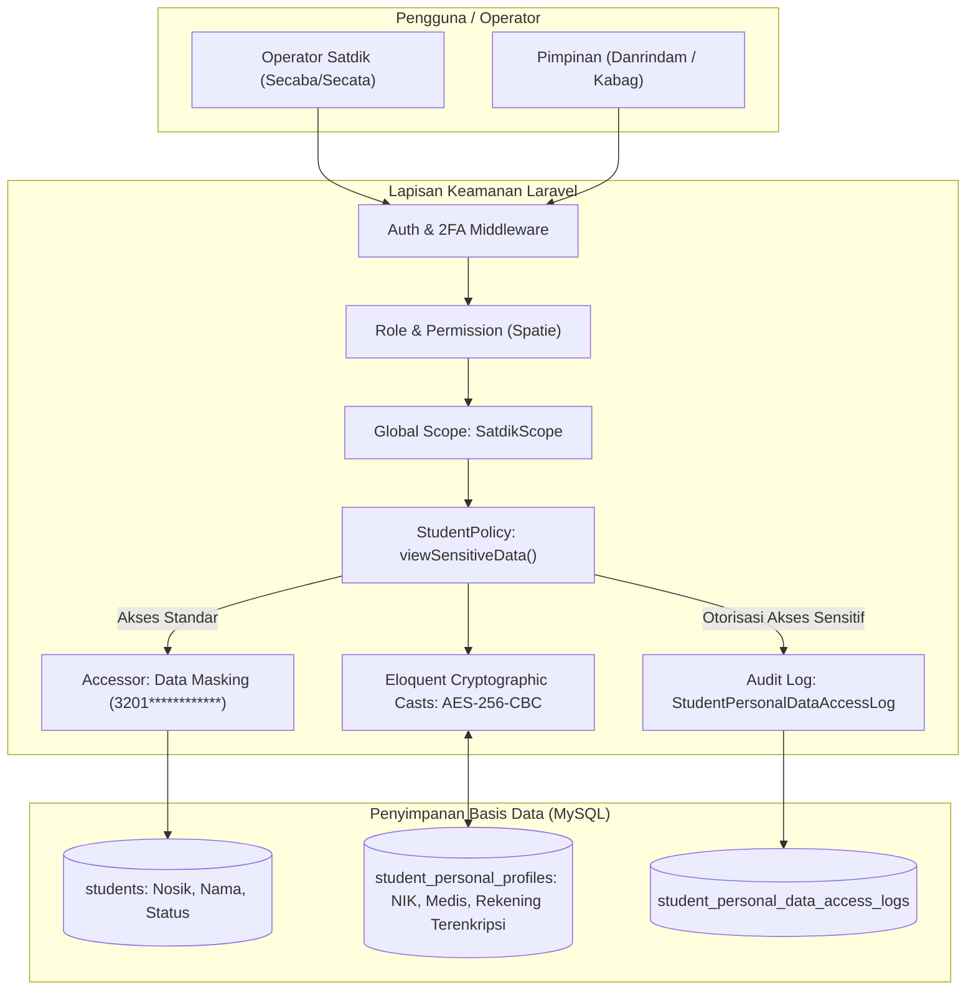
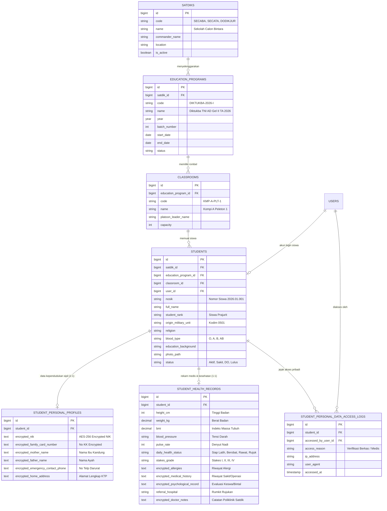

# RANCANG BANGUN PENGOLAHAN DATA SISWA PER SATDIK & PELINDUNGAN DATA PRIBADI MENGGUNAKAN LARAVEL
## Sistem Informasi Pembinaan Satuan Pendidikan Terpadu (SIPANDU-WBK) Rindam

---

## 1. Landasan & Latar Belakang

Resimen Induk Daerah Militer (Rindam) membawahi 5 Satuan Pendidikan (Satdik):
1. **Secaba** (Sekolah Calon Bintara) — menyelenggarakan Diktukba TNI AD & Diktukba Khusus/Otsus.
2. **Secata** (Sekolah Calon Tamtama) — menyelenggarakan Dikmata TNI AD (Pendidikan Pertama Tamtama).
3. **Dodikjur** (Depo Pendidikan Kejuruan) — menyelenggarakan Dikjurba & Dikjurta berbagai kecabangan.
4. **Dodiklatpur** (Depo Pendidikan Latihan Tempur) — menyelenggarakan Diklatpur, Taktik Regu, dan Kemahiran Menembak.
5. **Dodik Bela Negara** (Depo Pendidikan Bela Negara) — menyelenggarakan Diklat Kader Bela Negara, Komponen Cadangan (Komcad), dan Diklat Karakter Kebangsaan.

Dalam pengelolaan peserta didik (serdik/siswa), terdapat dua tantangan krusial:
1. **Partisi Data per Satdik (*Data Partitioning / Multi-Tenancy*)**:
   - Operator Secaba hanya berwenang mengelola serdik Secaba.
   - Operator Secata hanya berwenang mengelola serdik Secata.
   - Pimpinan (Danrindam, Wadan, Kabagdiklat) memiliki pandangan menyeluruh lintas Satdik (*cross-satdik aggregate view*).
2. **Pelindungan Data Pribadi (*Personal Data Protection*)**:
   - Mengacu pada **UU No. 27 Tahun 2022 tentang Pelindungan Data Pribadi (PDP)** dan **PermenPAN-RB No. 90/2021 (Penguatan Pengawasan & Integritas)**.
   - Data siswa mencakup data identitas sipil (NIK, No KK), data keluarga (Ibu Kandung, Kontak Darurat), data kesehatan/medis (Golongan Darah, Riwayat Penyakit/Alergi, Stakes Keswa), dan catatan psikologis.
   - Seluruh data pribadi tersebut wajib dilindungi dari risiko kebocoran data, penyalahgunaan wewenang, dan akses tanpa hak.

---

## 2. Arsitektur Pelindungan Data Pribadi di Laravel



### 4 Pilar Pengamanan Data Pribadi di Laravel:
1. **Enkripsi Kriptografis pada Model (`encrypted` cast)**:
   - Data tersimpan dalam bentuk *ciphertext* terenkripsi AES-256-CBC di basis data MySQL menggunakan `APP_KEY` Laravel. Apabila basis data dicuri atau di-dump, informasi pribadi tidak dapat dibaca.
2. **Penyamaran Data Otomatis (*Data Masking*)**:
   - Secara default, tampilan di tabel hanya memunculkan 4 digit awal dan 4 digit akhir (misal NIK: `3201********1234`), mencegah *shoulder surfing* atau kebocoran saat layar diproyeksikan.
3. **Penyekatan Satdik (*Satdik Multi-Tenancy Scope*)**:
   - Memanfaatkan Laravel Global Scope (`SatdikScope`), kueri `Student::all()` secara otomatis disaring berdasarkan Satdik tempat operator ditugaskan.
4. **Jejak Audit Akses Data Sensitif (*Access Audit Trail*)**:
   - Setiap aksi pembukaan data asli (*reveal plaintext*) memicu pencatatan ke tabel `student_personal_data_access_logs` yang merekam identitas pengakses, ID siswa, waktu, IP address, dan alasan akses.

---

## 3. Skema Basis Data Relasional Data Siswa per Satdik



---

## 4. Implementasi Kode Laravel (Arsitektur Backend)

### 4.1 Migrasi Basis Data (`database/migrations`)

```php
// 1. Tabel Satdik
Schema::create('satdiks', function (Blueprint $table) {
    $table->id();
    $table->string('code', 30)->unique(); // SECABA, SECATA, DODIKJUR, DODIKLATPUR, BELANEGARA
    $table->string('name', 150);
    $table->string('commander_title', 100)->default('Komandan Satdik');
    $table->string('commander_name', 150)->nullable();
    $table->string('location', 200)->nullable();
    $table->boolean('is_active')->default(true);
    $table->timestamps();
});

// 2. Tabel Siswa (Identitas Publik Militer)
Schema::create('students', function (Blueprint $table) {
    $table->id();
    $table->foreignId('satdik_id')->constrained('satdiks')->cascadeOnDelete();
    $table->foreignId('education_program_id')->constrained('education_programs')->cascadeOnDelete();
    $table->foreignId('classroom_id')->nullable()->constrained('classrooms')->nullOnDelete();
    $table->foreignId('user_id')->nullable()->constrained('users')->nullOnDelete();
    
    $table->string('nosik', 40)->unique(); // Nomor Siswa
    $table->string('full_name', 150);
    $table->string('student_rank', 50)->default('Siswa');
    $table->string('origin_military_unit', 100)->nullable(); // Pengiriman Kodim/Korem
    $table->string('birth_place', 100)->nullable();
    $table->date('birth_date')->nullable();
    $table->string('gender', 10)->default('L');
    $table->string('religion', 30)->nullable();
    $table->string('blood_type', 10)->nullable();
    $table->string('photo_path')->nullable();
    $table->enum('status', ['Aktif', 'Sakit', 'Dinas Luar', 'DO / Dikeluarkan', 'Lulus'])->default('Aktif');
    
    $table->timestamps();
    $table->softDeletes();

    $table->index(['satdik_id', 'status']);
    $table->index(['education_program_id', 'classroom_id']);
});

// 3. Tabel Data Pribadi Terenkripsi (SIPANDU-WBK)
Schema::create('student_personal_profiles', function (Blueprint $table) {
    $table->id();
    $table->foreignId('student_id')->unique()->constrained('students')->cascadeOnDelete();
    
    // Seluruh data di bawah ini disimpan terenkripsi (TEXT/LONGTEXT untuk menampung ciphertext)
    $table->text('nik'); // Nomor Induk Kependudukan (AES-256)
    $table->text('family_card_number')->nullable(); // No KK
    $table->text('mother_name')->nullable(); // Nama Ibu Kandung
    $table->text('father_name')->nullable();
    $table->text('emergency_contact_name')->nullable();
    $table->text('emergency_contact_phone')->nullable();
    $table->text('home_address')->nullable();
    
    $table->timestamps();
});

// 4. Tabel Audit Log Akses Data Pribadi
Schema::create('student_personal_data_access_logs', function (Blueprint $table) {
    $table->id();
    $table->foreignId('student_id')->constrained('students')->cascadeOnDelete();
    $table->foreignId('accessed_by_user_id')->constrained('users')->cascadeOnDelete();
    $table->string('access_reason', 255);
    $table->string('ip_address', 45);
    $table->text('user_agent')->nullable();
    $table->timestamp('accessed_at');
});
```

---

### 4.2 Model Enkripsi Data Pribadi (`app/Models/StudentPersonalProfile.php`)

```php
namespace App\Models;

use Illuminate\Database\Eloquent\Model;
use Illuminate\Database\Eloquent\Relations\BelongsTo;

class StudentPersonalProfile extends Model
{
    protected $guarded = ['id'];

    /**
     * Pelindungan Data Pribadi via Native Laravel Eloquent Encrypted Casts (AES-256-CBC).
     */
    protected function casts(): array
    {
        return [
            'nik' => 'encrypted',
            'family_card_number' => 'encrypted',
            'mother_name' => 'encrypted',
            'father_name' => 'encrypted',
            'emergency_contact_name' => 'encrypted',
            'emergency_contact_phone' => 'encrypted',
            'home_address' => 'encrypted',
        ];
    }

    public function student(): BelongsTo
    {
        return $this->belongsTo(Student::class);
    }

    /**
     * Accessor Penyamaran NIK: Hanya 4 digit awal dan 4 digit akhir yang terlihat.
     * Contoh: 3201********1234
     */
    public function getMaskedNikAttribute(): string
    {
        $val = $this->nik;
        if (empty($val) || strlen($val) < 8) return '****************';
        return substr($val, 0, 4) . '********' . substr($val, -4);
    }

    /**
     * Accessor Penyamaran Nomor HP Darurat.
     * Contoh: 0812********89
     */
    public function getMaskedEmergencyPhoneAttribute(): string
    {
        $val = $this->emergency_contact_phone;
        if (empty($val) || strlen($val) < 6) return '**********';
        return substr($val, 0, 4) . '********' . substr($val, -2);
    }
}
```

---

### 4.3 Multi-Tenancy Scope per Satdik (`app/Models/Scopes/SatdikScope.php`)

```php
namespace App\Models\Scopes;

use Illuminate\Database\Eloquent\Builder;
use Illuminate\Database\Eloquent\Model;
use Illuminate\Database\Eloquent\Scope;
use Illuminate\Support\Facades\Auth;

class SatdikScope implements Scope
{
    /**
     * Menyekat kueri data siswa hanya untuk Satdik tempat user bertugas,
     * kecuali user berpangkat/role Pimpinan (Danrindam, Super Admin, Kabagdiklat).
     */
    public function apply(Builder $builder, Model $model): void
    {
        $user = Auth::user();
        if (!$user) return;

        // Pimpinan & Super Admin dapat melihat seluruh Satdik
        if ($user->hasRole(['super_admin', 'pimpinan', 'kabag_diklat'])) {
            return;
        }

        // Operator terikat pada Satdik tertentu
        if ($user->satdik_id) {
            $builder->where($model->getTable() . '.satdik_id', $user->satdik_id);
        }
    }
}
```

---

### 4.4 Otorisasi & Pencatatan Audit Log (`app/Services/StudentPersonalDataService.php`)

```php
namespace App\Services;

use App\Models\Student;
use App\Models\StudentPersonalProfile;
use App\Models\StudentPersonalDataAccessLog;
use App\Models\User;
use Illuminate\Support\Facades\Request;
use Illuminate\Auth\Access\AuthorizationException;

class StudentPersonalDataService
{
    /**
     * Membuka data pribadi lengkap serdik dengan otorisasi dan pencatatan audit trail wajib.
     */
    public function revealSensitiveData(User $user, Student $student, string $reason): array
    {
        // 1. Verifikasi Izin Khusus
        if (!$user->can('view-sensitive-student-data')) {
            throw new AuthorizationException('Anda tidak memiliki izin membuka data pribadi sensitif serdik.');
        }

        // 2. Catat Log Audit Akses (SIPANDU-WBK Audit Trail)
        StudentPersonalDataAccessLog::create([
            'student_id' => $student->id,
            'accessed_by_user_id' => $user->id,
            'access_reason' => $reason,
            'ip_address' => Request::ip() ?? '127.0.0.1',
            'user_agent' => Request::userAgent(),
            'accessed_at' => now(),
        ]);

        $profile = $student->personalProfile;

        // 3. Kembalikan data yang didekripsi (Pemurnian Data Pribadi Sipil tanpa data perbankan, BPJS, atau medis)
        return [
            'nosik' => $student->nosik,
            'full_name' => $student->full_name,
            'nik' => $profile?->nik,
            'family_card_number' => $profile?->family_card_number,
            'mother_name' => $profile?->mother_name,
            'father_name' => $profile?->father_name,
            'emergency_contact_phone' => $profile?->emergency_contact_phone,
            'home_address' => $profile?->home_address,
        ];
    }
}
```

---

## 5. Ringkasan Fitur Pengolahan Data Siswa di Aplikasi

| Modul Fitur | Fungsi Utama | Keamanan & Hak Akses |
|---|---|---|
| **Pilih Satdik (Satdik Switcher)** | Pimpinan dapat beralih antara Secaba, Secata, Dodikjur, Dodiklatpur, Dodik Bela Negara. Operator terkunci pada Satdiknya. | `SatdikScope` multi-tenancy |
| **Buku Induk Serdik** | Rekapitulasi serdik per Gelombang/Angkatan, Kompi, dan Peleton. | Standard Operator Binsatdik |
| **Impor Berkas Excel per Satdik** | Unggah data siswa dari Excel pendaftaran awal dengan otomatisasi enkripsi kolom NIK & nomor rekening. | Validasi skema & sanitasi |
| **Kartu Tanda Siswa (KTS) & QR** | Cetak kartu serdik dengan QR Code verifikasi status pendidikan aktif. | Watermark dinamis |
| **Panel Data Pribadi Sensitif** | Tab khusus yang menyajikan data medis, keluarga, dan NIK dalam mode tersamar (*masked*). Tombol "Buka Data Asli" mewajibkan pengisian alasan audit. | Role `Paban Pers / Dan Satdik`, tercatat di log audit |
| **Daftar Log Akses PDP** | Halaman pemantauan untuk Tim Zona Integritas (Area 5 Pengawasan) yang menampilkan siapa saja yang telah mengakses data pribadi serdik. | Read-only Tim ZI & Pimpinan |
